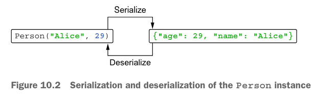
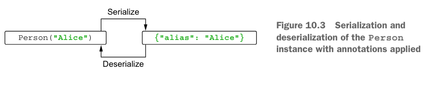
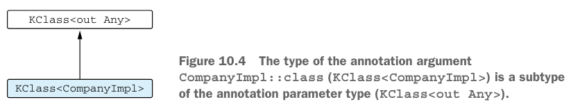
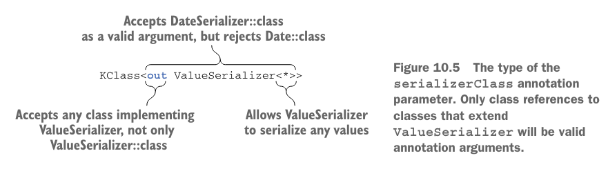

# 10. Annotations and reflection

1. Declaring and applying annotations
2. Reflection: introspecting Kotlin objects at runtime
3. Summary

> ### This chapter covers:
>
> - Applying and defining annotations
> - Using reflection to introspect classes at runtime
> - Kotlin project 실 예시

---

- annotation 사용 문법은 Java와 유사
- annotaion 선언 문법은 Java와 다소 다름
- 일반적인 reflection API는 Java와 유사하나, 세부적으로 조금 다름

## 1. Declaring and applying annotations

- annotation은 선언과 동시에 _metadata_ 를 추가하는 방법
    - _metadata_ : 어노테이션 설정에 따라 런타임에 사용될 수 있는 정보

### Applying annotations

- `@` 문자 사용

- 파라미터 가능 타입 : primitive, String, enum, class reference, another annotation, array
- `@MyAnnotation(MyClass::class)` : `MyClass` 클래스의 참조를 전달
- annotation을 인자로 전달 시 `@`를 붙이지 않음
    - `@Deprecated("Use removeAt(index) instead.", ReplaceWith("removeAt(index)"))`
- `arrayOf` 로 배열 전달 가능
    - `@RequestMapping(path = arrayOf("/foo", "/bar"))`

```kotlin
import org.junit.*

class MyTest {
    @Test
    fun testTrue() {
        assertTrue(true)
    }
}
```

- `@Deprecated` : Java와 동일
    - `replaceWith` : 대체할 함수를 지정할 수 있음
    - IntelliJ IDEA에서 deprecated된 함수를 사용하려하면 대체할 함수를 제안해줌

````
@Deprecated("Use removeAt(index) instead.", ReplaceWith("removeAt(index)"))
fun remove(index: Int) { ... }
````

- 어노테이션 argument는 compile-time에 특정 가능해야함
    - `const` modifier를 사용하면 compile-time에 상수로 사용 가능

````
const val TEST_TIMEOUT = 100L // compile-time 상수

@Test(timeout = TEST_TIMEOUT) fun testMethod() { ... }
````

### Annotation targets


- _use-site target_ annotation : 어노테이션을 어디에 적용할지 지정
- e.g. JUnit에서 `TemporaryFolder` rule을 적용해 test가 종료되면 임시 생성 파일, 폴더를 삭제
- target 목록
    - `property` : Java 어노테이션은 property에는 적용 불가
    - `field` : property를 위해 생성된 필드
    - `get` : property getter
    - `set` : property setter
    - `receiver` : 확장 함수나 프로퍼티의 수신 객체 파라미터
    - `param` : 생성자 파라미터
    - `setparam` : setter 파라미터
    - `delegate` : 위임 프로퍼티의 위임 인스턴스
    - `file` : 파일 전체

```kotlin
class HasTempFolder {
    @get:Rule
    val folder = TemporaryFolder()

    @Test
    fun testUsingTempFolder() {
        val createdFile = folder.newFile("myfile.txt")
        val createdFolder = folder.newFolder("subfolder")
        // ...
    }
}
```

```
fun test(list: List<*>) {
  @Suppress("UNCHECKED_CAST")
  val strings = list as List<String>
  // ...
}
```

- 어노테이션을 임의의 표현식에도 사용 가능 e.g. `@Suppress`

### Using annotations to customize JSON serialization

- _Serialization_ : object를 network에 적재 가능한 text나 바이너리로 변환하는 과정
- _Deserialization_ : 반대 과정
- JSON : Serialization의 대표적인 포맷
- Jackson library : JSON serialization/deserialization을 위한 Java library



```kotlin
data class Person(val name: String, val age: Int)

fun main() {
    val person = Person("Alice", 29)
    println(serialize(person)) // {"name": "Alice", "age": 29}

    val json = """{"name": "Alice", "age": 29}"""
    println(deserialize<Person>(json)) // Person(name=Alice, age=29)
}
```



```kotlin
data class Person(
    @JsonName("alias") val firstName: String,
    @JsonExclude val age: Int? = null,
)
```

- `@JsonExclude ` : serialization에서 제외할 property
- `@JsonName` : JSON에서 사용할 이름 지정

### Declaring annotations

```java
/* Java */
public @interface JsonName {
    String value();
}
```

```kotlin
annotation class JsonExclude

annotation class JsonName(val name: String)

```

- `annotation` 키워드로 선언
- `@JsonName(name = "first_name")` == `@JsonName("first_name")`

### Meta-annotations: controlling how annotations is processed

- _meta-annotations_ : 어노테이션 클래스에 적용된 어노테이션

```kotlin
@Target(AnnotationTarget.PROPERTY)
annotation class JsonExclude

@Target(AnnotationTarget.ANNOTATION_CLASS)
annotation class BindingAnnotation

@BindingAnnotation
annotation class MyBinding
```

- `@Target` : 어노테이션을 적용할 수 있는 대상 지정
- Java의 `@Retention` : 어노테이션을 어떻게 저장할지 지정
    - `@Retention(AnnotationRetention.RUNTIME)` : 런타임에 어노테이션 정보를 사용 가능
    - Kotlin은 기본적으로 `RUNTIME`으로 지정됨

### Classes as annotation parameters

- 어노테이션 인자로 클래스를 전달하는 경우
- `::class` 를 사용하여 클래스 참조를 전달

```kotlin
annotation class DeserializeInterface(val targetClass: KClass<out Any>)

interface Company {
    val name: String
}
data class CompanyImpl(override val name: String) : Company
data class Person(
    val name: String,
    @DeserializeInterface(CompanyImpl::class) val company: Company,
)
```

- Jkid가 `company` 를 읽을때 마다 `CompanyImpl` 인스턴스를 생성하도록 지정



- `KClass` == Java `java.lang.Class`

### Generic classes as annotation parameters

```kotlin
interface ValueSerializer<T> {
    fun toJsonValue(value: T): Any?
    fun fromJsonValue(jsonValue: Any?): T
}

annotation class CustomSerializer(
    val serializerClass: KClass<out ValueSerializer<*>>,
)

data class Person(
    val name: String,
    @CustomSerializer(DateSerializer::class) val birthDate: Date,
)
```



## 2. Reflection: introspecting Kotlin objects at runtime

## 3. Summary

