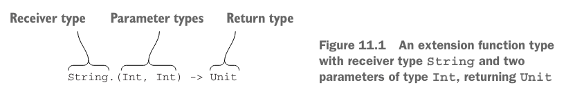

# 11. DSL construction

1. From APIs to DSLs
2. Building structured APIs: lamdas with receivers in DSLs
3. More fleible block nesting with the "invoke" convention
4. Kotlin DSLs in practice
5. Summary

> ### This chapter covers
>
> - dsl 만들기
> - reciver로 람다 사용하기
> - `invoke` convention
> - Kotlin DSLs 예제

---

## 1. From APIs to DSLs

- code의 가독성 : 의도가 명확
- 불필요한 문법 제거
- kotlin 은 _fully statically typed_ 언어
    - _fully statically typed_ : 모든 변수의 타입이 컴파일 시점에 결정

| regular syntax                     | Clean syntax                              | feature in use                  |
|------------------------------------|-------------------------------------------|---------------------------------|
| `StringUtil.capitalize("hello")`   | `"hello".capitalize()`                    | extension functions             |
| `1.to("one")`                      | `1 to "one"`                              | infix functions                 |
| `set.add("a")`                     | `set += "a"`                              | operator overloading            |
| `map.get("key")`                   | `map["key"]`                              | COnvention for the `get` method |
| `file.use({f->f.read()})`          | `file.use { read() }`                     | lambdas outside of parentheses  |
| `sb.append("yes") sb.append("no")` | `with(sb) { append("yes") append("no") }` | lambdas with receivers          |

### The concept of domain-specific languages

- _general-purpose programming language_ : 컴퓨터로 언어 레벨에서 모든 문제 해결 가능
- _domain-specific language_ : 특정 문제 (Task, Domain) 해결을 위한 언어
    - ex) SQL, HTML, CSS
    - 간결한 문법, declarative
- 단점 : host application과의 호환, 결합 문제
    - host app은 _general-purpose programming language_ 로 작성되어 즉시 프로그램에 임베디드
- 해결책 : _internal DSL_ (host language의 기능을 이용한 DSL)

### Internal DSLs

- _internal DSL_ : host language의 기능을 이용한 DSL

```sql
SELECT Country.name, COUNT(Customer.id)
FROM Country
         JOIN Customer
              ON Country.id = Customer.country_id
GROUP BY Country.name
ORDER BY COUNT(Customer.id) DESC LIMIT 1
```

```kotlin
// SQL 쿼리 작성 (= Task)에 특화된 Kotlin DSL의 라이브러리
(Country join Customer)
    .slice(Country.name, Count(Customer.id))
    .selectAll()
    .groupBy(Country.name)
    .orderBy(Count(Customer.id), isAsc = false)
    .limit(1)
```

### Structure of DSLs

````
dependencies { // lamda nesting
  compile("junit:junit:4.11")
  compile("com.google.inject:guice:4.1.0")
}
````

- Kotlin DSL은 주로 람다 중첩 (nesting), 메서드 연쇄 호출로 이루어짐

### Building HTMl with an internal DSL

- `kotlinx.html` 라이브러리 사용

```kotlin
fun createSimpleTable() = createHTML().table {
    tr {
        td { +"cell" }
    }
}

fun createAnotherTable() = createHTML().table {
    val numbers = mapOf(1 to "one", 2 to "two")
    for ((num, string) in numbers) {
        tr {
            td { +"$num" }
            td { +string }
        }
    }
}
```

```html

<table>
    <tr>
        <td>cell</td>
    </tr>
</table>

<table>
    <tr>
        <td>1</td>
        <td>one</td>
    </tr>
    <tr>
        <td>2</td>
        <td>two</td>
    </tr>
</table>
```

## 2. Building structured APIs: lamdas with receivers in DSLs

- 람다와 리시버는 DSL에서 중요한 역할

### Lamdas with receivers and extension functions types

```kotlin
// function type parameter
fun buildString(
    builderAction: (StringBuilder) -> Unit,
): String {
    val sb = StringBuilder()
    builderAction(sb)
    return sb.toString()
}

fun main() {
    val s = buildString {
        it.append("Hello, ")
        it.append("World!")
    }
    println(s)
}

```



```kotlin
// function type with receiver parameter
fun buildString(
    builderAction: StringBuilder.() -> Unit,
): String {
    val sb = StringBuilder()
    sb.builderAction()
    return sb.toString()
}

fun main() {
    val s = buildString {
        this.append("Hello, ")
        append("World!")
    }
    println(s)
}
```

- _receiver type_ : _extension function type_ 을 사용하면 람다의 리시버를 지정할 수 있음


```kotlin
// lamda with receiver 를 변수에 저장
val appendExcl: StirngBuilder.() -> Unit = { this.append("!") }

fun main() {
    val sb = StringBuilder("Hi")
    sb.appendExcl()
    println(sb)
}
```

### using lamdas with receivers in HTML builder

- _HTML builder_ : Kotlin DSL for HTML
- _type-safe builders_

```kotlin
open class Tag
class TABLE : Tag {
    fun tr(init: TR.() -> Unit)
}
class TR : Tag {
    fun td(init: TD.() -> Unit)
}
class TD : Tag

fun createSimpleTable() = createHTML().table {
    tr {
        td { +"cell" }
    }
}

```

```kotlin
// 명시적으로 receiver 지정
fun createSimpleTable() = createHTML().table {
        (this@table).tr {
            (this@tr).td {
                +"cell"
            }
        }
    }
```

```kotlin
open class Tag(val name: String) {
    private val children = mutableListOf<Tag>()
    protected fun <T : Tag> doInit(child: T, init: T.() -> Unit) {
        child.init()
        children.add(child)
    }
    override fun toString() =
        "<$name>${children.joinToString("")}</$name>"
}

fun table(init: TABLE.() -> Unit) = TABLE().apply(init)
class TABLE : Tag("table") {
    fun tr(init: TR.() -> Unit) = doInit(TR(), init)
}
class TR : Tag("tr") {
    fun td(init: TD.() -> Unit) = doInit(TD(), init)
}
class TD : Tag("td")

fun createTable() =
    table {
        tr {
            td {
            }
        }
    }

fun main() {
    println(createTable())
}
```

### Kotlin builders: enabling abstractions and reuse

```kotlin
fun buildDropdown() = createHTML().div(classes = "dropdown") {
    button(classes = "btn dropdown-toggle") {
        +"Dropdown"
        span(classes = "caret")
    }
    ul(classes = "dropdown-menu") {
        li { a("#") { +"Action" } }
        li { a("#") { +"Another action" } }
        li { role = "separator"; classes = setOf("divider") }
        li { classes = setOf("dropdown-header"); +"Header" }
        li { a("#") { +"Separated link" } }
    }
}
```

```kotlin
// 중복/반복 코드를 제거 (별도 함수로 추출)
fun dropdownExample() = createHTML().dropdown {
        dropdownButton { +"Dropdown" }
        dropdownMenu {
            item("#", "Action")
            item("#", "Another action")
            divider()
            dropdownHeader("Header")
            item("#", "Separated link")
        }
    }
fun StringBuilder.dropdown(
    block: DIV.() -> Unit,
): String = div("dropdown", block)
fun UL.divider() = li { role = "separator"; classes = setOf("divider") }
fun UL.dropdownHeader(text: String) = li { classes = setOf("dropdown-header"); +text }
fun DIV.drodownMenu(block: UL.() -> Unit) = ul(classes = "dropdown-menu", block)
```

## 3. More flexible block nesting with the "invoke" convention

- `invoke` convention : custom tyupe의 오브젝트를 함수처럼 호출할 수 있게 함

### The “invoke” convention: objects callable as functions

- 메서드 호출 문법없이 메서드 호출
- e.g. `foo[bar]` -> `foo.get(bar)`

```kotlin
class Greeter(val greeting: String) {
    operator fun invoke(name: String) {
        println("$greeting, $name!")
    }
}

fun main() {
    val bavarianGreeter = Greeter("Servus")
    bavarianGreeter("Dmitry") // Servus, Dmitry!
}
```

- `bavarianGreeter("Dmitry")` 은 `bavarianGreeter.invoke("Dmitry")` 로 컴파일됨

### The “invoke” convention and functional types

```kotlin
// 2개의 인자를 받는 함수
interface Function2<in P1, in P2, out R> {
    operator fun invoke(p1: P1, p2: P2): R
}
```

- 람다 호출 시 `invoke` 메서드 호출

```kotlin
data class Issue(
    val id: String, val project: String, val type: String,
    val priority: String, val description: String,
)
class ImportantIssuesPredicate(val project: String) : (Issue) -> Boolean {
    override fun invoke(issue: Issue): Boolean {
        return issue.project == project && issue.isImportant()
    }
    private fun Issue.isImportant(): Boolean {
        return type == "Bug" &&
                (priority == "Major" || priority == "Critical")
    }
}

fun main() {
    val i1 = Issue("IDEA-154446", "IDEA", "Bug", "Major", "Save settings failed")
    val i2 = Issue(
        "KT-12183",
        "Kotlin",
        "Feature",
        "Normal",
        "Intention: convert several calls on the same receiver to with/apply"
    )

    val predicate = ImportantIssuesPredicate("IDEA")
    for (issue in listOf(i1, i2).filter(predicate)) { // predicate를 람다처럼 호출
        println(issue.id)
    }
}
```

### The “invoke” convention in DSLs: declaring dependencies in Gradle

````
dependencies {
    compile("junit:junit:4.11")
    compile("com.google.inject:guice:4.1.0")
}
````

```kotlin
class DependencyHandler {
    fun compile(coordinate: String) {
        println("Added dependency on $coordinate")
    }
    operator fun invoke(
        body: DependencyHandler.() -> Unit,
    ) {
        body()
    }
}

fun main() {
    val dependencies = DependencyHandler()
    dependencies {
        compile("org.jetbrains.kotlin:kotlin-reflect:1.0.0")
    }
}
```

## 4. Kotlin DSLs in practice

### Chaining infix calls: "should" in test frameworks

```kotlin
infix fun <T> T.should(matcher: Matcher<T>) = matcher.test(this)

fun main() {
    s should startWith("kot") // s.startWith("kot")
    "kotlin" should start with "kot"
}
```

```kotlin
// chained infix call을 지원하는 API 생성하기

object start

infix fun String.should(x: start): StartWrapper = StartWrapper(this)

class StartWrapper(val value: String) {
    infix fun with(prefix: String) =
        if (!value.startsWith(prefix))
            throw AssertionError(
                "String does not start with $prefix: $value"
            )

    infix fun have(substring: String) =
        if (!value.contains(substring))
            throw AssertionError(
                "String does not contain substring $substring: $value"
            )
}

fun main() {
    "kotlin" should start with "kot"
    "kotlin" should have substring "otl"
}
```

### Defining extensions on primitive types: handling dates

```kotlin
val Int.days: Period
    get() = Period.ofDays(this)
val Period.ago: LocalDate
    get() = LocalDate.now() - this
val Period.fromNow: LocalDate
    get() = LocalDate.now() + this

fun main() {
    println(1.days.ago)
    println(1.days.fromNow)
}
```

### Member extension functions: internal DSLs for SQL

- _member extensions_ : 클래스의 멤버이면서, 다른 타입의 확장이기도 한 fuction (or property)

```kotlin
class Table {
    fun integer(name: String): Column<Int>
    fun varchar(name: String, length: Int): Column<String>
    fun <T> Column<T>.primaryKey(): Column<T>
    fun Column<Int>.autoIncrement(): Column<Int>
    // ...
}

object Country : Table() {
    val id = integer("id").autoIncrement().primaryKey()
    val name = varchar("name", 50)
}
```

- `integer()`, `varchar()` : `Table` 클래스의 멤버이면서 `Column` 클래스의 확장

```kotlin
fun Table.select(where: SqlExpressionBuilder.() -> Op<Boolean>): Query

object SqlExpressionBuilder {
    infix fun <T> Column<T>.eq(t: T): Op<Boolean>
    // ...
}

fun main() {
    val result = (Country join Customer)
        .select { Country.name eq "USA" }
    result.forEach { println(it[Customer.name]) }

}
```

### Anko: creating Android UIs dynamically

```kotlin
fun Context.alert(
    message: String,
    title: String,
    init: AlertDialogBuilder.() -> Unit,
)
class AlertDialogBuilder {
    fun positiveButton(text: String, callback: DialogInterface.() -> Unit)
    fun negativeButton(text: String, callback: DialogInterface.() -> Unit)
    // ...
}

fun Activity.showAreYouSureAlert(process: () -> Unit) {
    alert(
        title = "Are you sure?",
        message = "Are you really sure?"
    ) {
        positiveButton("Yes") { process() }
        negativeButton("No") { cancel() }
    }
}

fun main() {
    verticalLayout {
        val email = editText {
            hint = "Email"
        }
        val password = editText {
            hint = "Password"
            transformationMethod =
                PasswordTransformationMethod.getInstance()
        }
        button("Log In") {
            onClick {
                logIn(email.text, password.text)
            }
        }
    }
}
```

## 5. Summary
