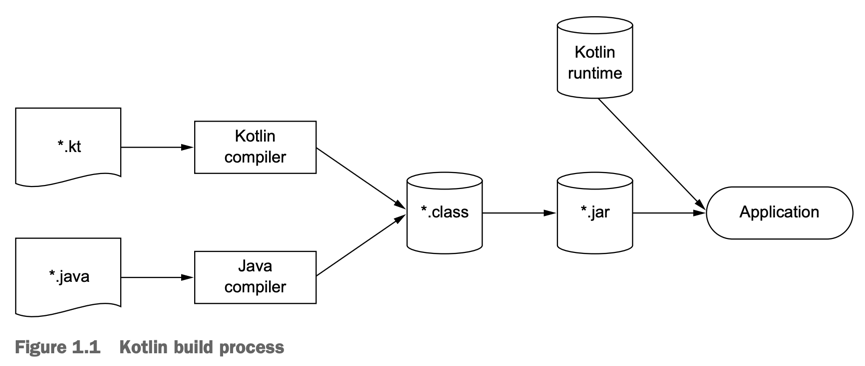

# 1. Kotlin: what and why

1. A taste of Kotlin
2. Kotlin's primary traits
3. Kotlin applications
4. The philosophy of Kotlin
5. Using the Kotlin tools
6. Summary

> This chapter covers
>
> - kotlin 기본 형태
> - Kotlin 언어 메인 특징
> - server-side, Android에서 가능
> - 다른 언어와의 차이점
> - Kotlin으로 작성하고 실행하기

---

- Kotlin은 Java 플랫폼을 위한 프로그램 언어
- 간결, 안전, 실용, Java Code와의 호환
- Java가 쓰이는 대부분의 server-side 개발, Android 앱에서 사용 가능
- 기존 Java 라이브러리, 프레임웤과 호환 (동일 성능으로)

## 1. A taste of Kotlin

````kotlin
data class Person(val name: String, val age: Int? = null)

fun main(args: Array<String>) {
    val persons = listOf(Person("Karina"), Person("Hani", age = 20))
    val oldest = persons.maxBy { it.age ?: 0 }

    println("The oldest is: $oldest")
}
````

## 2. Kotlin's primary traits

### Target platforms : server-side, Android, anywhere Java runs

java 개발자들에게 도움을 줌

- server-side 코드 작성 (backends web application)
- Android 기기에서 동작할 mobile applciation 개발
- 기타
    - Intel Multi-OS 엔진으로 iOS 기기에서 코틀린 코드 실행
    - TornadoFX와 JavaFX 실행
- kotlin을 Javascript로 컴파일
    - 브라우저에서 Kotlin 코드 실행 가능

### Statically typed

- Java처럼 Kotlin도 _statically typed_ 언어
    - _statically typed_ : 다음을 컴파일 타임에 파악
        - 모든 표현식
        - 작성한 메서드, 필드가 사용중인 오브젝트에 있는지
    - _dynamically typed_ : 다음을 런타임에 파악
        - 선언한 변수, 함수, 데이터 리턴 타입, 메서드, 필드 레퍼런스 등
        - Groovy, JRupy

#### type inference

````kotlin
val x = 1 // Kotlin이 자동으로 x를 Int로 선언
````

- _type inference_ :  kotlin은 Java와 달리 타입 선언을 생략해도 됨
- 장점 1. 성능 : 메서드 호출이 빠름 (런타임에 어떤 메서드를 호출할 지 판별 필요 없음)
- 장점 2. Reliability : 컴파일러가 프로그램의 정확성을 검증, 런타임에 충돌 가능성 해소
- 장점 3. 유지보수성
- 장점 4. tool support : 리팩터링, 간결한 코드, IDE 기능 활용 가능

#### nullable type

- `null` pointer 예외를 컴파일 타임에 감지할 수 있게 함

#### function type

- functional programming 의 기본 아이디어

### Functional and object-oriented

코틀린이 지원하는 것

- _Function types_ : 함수를 파라미터로 전달/리턴 가능
- _Lamda expressions_ : 코드를 블록으로 감싸서 보일러페이트 없이 전달
- _Data classes_ : 불변 value object
- functional style로 작성된 풍부한 API

#### Functional programming의 기본 컨셉

- _First-class functions_ : function을 value처럼 취급
    - function을 변수에 담고, 파라미터로 전달, 리턴할 수 있음
- _Immutablity_ : 불변객체를 다룸
- _No side effects_ : 동일한 input에 동일한 output을 리턴하는 pure function
    - 바깥 세상의 오브젝트나 다른 오브젝트의 상태를 변경하지 않음

#### Functional style의 이점

- _conciseness_ : 엘레강스하고 간결함, 중복이 줄어듦
    - 람다 표현식으로 익명 함수를 전달 가능
- _safe multithreading_
    - 멀티 스레딩 프로그램의 오류 핵심은 멀티 스레드에서 적절한 동기화로 동일한 데이터를 접근하는 것
    - pure function에서 불변객체에 접근하면 위처럼 구현 가능
- _easier testing_ : side effect가 없는 function은 고립 시켜 (많은 setup code 필요 없음) 테스트가 가능

```kotlin
fun findKarina() = findPerson { it.name == "Karina" }

fun findHani() = findPerson { it.name == "Hani" }
```

### Free and open source

- Kotlin의 컴파일러, 라이브러리, 관련 tool은 모두 오픈소스
- IntelliJ, Android Studio, Eclipse IDE 로 개발 가능

## 3. Kotlin applications

### Kotlin on the server side

#### Server-side program?

- HTML을 리턴하는 Web application
- HTTP를 통해 JSON을 리턴하는 JSON API 기반의 mobile application
- RPC 프로토콜로 다른 마이크로 서비스와 통신하는 마이크로 서비스

#### Kotlin server-side 프로그램의 장점

- 기존의 Java code와 호환
- 시스템 코드가 더 간결해지고 유지보수가 쉬워짐
- Builder pattern

````kotlin
fun renderPersonList(persons: Collection<Person>) =
    createHTML().table {
        for (person in persons) {
            tr {
                td { +person.name }
                td { +person.age }
            }
        }
    }
}
````

```kotlin
object CountryTable : IdTable() {
    val name = varchar("name", 250).uniqueIndex()
    val iso = varchar("iso", 2).uniqueIndex()
}

class Country(id: EntityID) : Entity(id) {
    var name: Stirng by CountryTable.name
    var iso: String by CountryTable.iso
}

var russia = Country.find { CountryTable.iso eq "RU" }.first()

println(russia.name)
````

### Kotlin on Android

- 전형적인 모바일 어플리케이션은 엔터프라이즈 애플리케이션과 다름
    - 더 작고, 다양한 디바이스에서 동작해야함
- Kotlin과 Android Framework를 결합해 더 생산적으로 개발 가능

#### reliability

- NPE와 같은 오류를 컴파일 타임에 잡아냄
- Java 6와 완벽히 호환

## 4. The philosophy of Kotlin

### Pragmatic

- _pragmatic_ : Kotlin은 real-world 프로그래밍을 위해 만들어짐
- 많은 현실 세계 애플리케이션을 개발하기 위해 개발된 언어
- 연구중인 언어가 아닌 실제로 사용되는 언어
- 특정 패러다임이나 프로그래밍 스타일을 강요하지 않음

### Concise

- 간결한 코드는 읽고 이해하기 쉬움
- 문접이 코드의 의도를 표현함
- 보일러플레이트 코드를 줄임
    - Java getter/setter, equals, hashCode, toString, 파라미터 생성자 등
- 람다 지원

### Safe

- _safe_ 언어 : 프로그램에 에러를 방지하는 언어
- 컴파일러가 정보와 코드를 분석하여 오류를 잡아냄
    - trade-off : 정보가 많아야 오류 분석 가능
- Kotlin은 Java보다 더 높은 레벨의 안전을 추구하면서 동시에 정보를 많이 안주어도 됨
- type safety : type inference로 타입을 명시하지 않아도 컴파일러가 추론
- null safety : nullable type을 지원하여 null pointer exception을 방지

```kotlin
val s: String? = null // nullable type
val s2: String = "" // non-nullable type
```

- `ClassCastException`을 방지하기 위한 코드에서 `is` 연산자로 체크와 캐스팅을 한번에 수행

```kotlin
if (value is String)
    println(value.toUpperCase())
```

### Interoperable

- 기존 라이브러리 사용 가능
- 코틀린에서 Java 코드를 호출 가능
- cross-language project를 완벽 지원
    - 임의의로 섞인 Java, Kotlin 코드를 컴파일 가능

## 5. Using the Kotlin tools

- Java처럼 실행 전에 컴파일 필요

### Compiling Kotlin code



1. `kotlinc` 명령어 :  `.kt` 확장자의 파일을 컴파일
2. 코틀린 컴파일러가 `.kt` 파일을 `.class` 파일로 변환
3. `.class` 파일을 JVM에서 실행

```shell
kotlinc <source file or directory> -include-runtime -d <jar name>
java -jar <jar name>
```

- _Kotlin runtime library_ : 코틀린 표준 라이브러리
    - 코틀린의 표준 라이브러리 클래스, 확장들을 포함
- Maven, Gradle, Ant 빌드 도구를 지원

### Plug-in for IntelliJ IDEA and Android Studio

- IntelliJ IDEA : 코틀린을 개발할 수 있는 가장 좋은 IDE
- 안정적이고 성숙하고 완전히 kotlin을 지원

### Interactive shell

- interactive shell (e.g. _REPL_) 을 사용해 간단한 코드를 실행하고 테스트 가능

### Eclipse plug-in

### Online playground

- http://try.kotl.in/

### Java-to-Kotlin converter

- Java 코드를 코틀린 코드로 변환하는 툴

## 6. Summary
