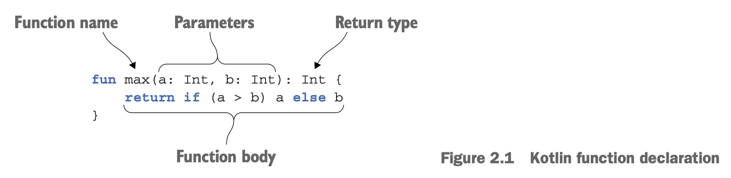
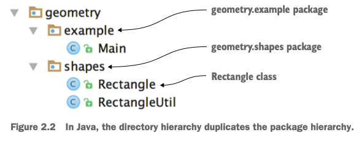
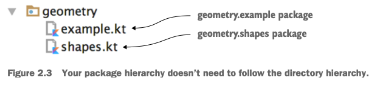
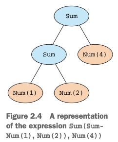
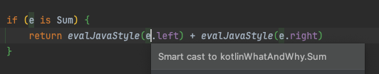

# 2. Kotlin basics

1. Basic elements: functions and variables
2. Classes and properties
3. Representing and handling choices: enums and `when`
4. Iterating over things: `while` and `for` loops
5. Exception in Kotlin
6. Summary

> This chapter covers
>
> - functions, variables, classes, enums and properties
> - structuring Kotlin source code
> - Smart casts
> - Throwing and handling exceptions

---

## 1. Basic elements: functions and variables

### Hello, world!

```kotlin

fun main(args: Array<String>) {
    println("Hello, World!")
}
```

| Java                                     | Kotlin                          |
|------------------------------------------|---------------------------------|
| `public static void main(String[] args)` | `fun main(args: Array<String>)` |
| `String[] args`                          | `Array<String>`                 |
| `System.out.println("Hello, World!");`   | `println("Hello, World!")`      |

- `fun` : 함수 선언`
- file 톱 레벨에 선언 가능
    - top-level : 클래스 안에 선언되지 않은 것
- `Array<String>` : Java의 `String[]`와 동일
    - Java와 달리 Array에 대한 특별한 문법이 없음
    - Java : `String[] args` <-> Kotlin : `Array<String>`
- `println` : Kotlin standard library 함수
- `;` : 선택사항

### Functions



```kotlin
fun main(args: Array<String>) {
    println("max of 0 and 42 is ${max(0, 42)}")
}

fun max(a: Int, b: Int): Int {
    return if (a > b) a else b
}

```

- `...: Int { ... }` : 함수의 반환 타입

> ### Statements (문장) and expressions (표현식)
>
> - kotlin의 `if`는 expression
> - expression은 값을 가짐, 다른 expression의 일부로 사용 가능
> - statement는 block의 최상위 요소, 값을 가지지 않음
> - Java는 모든 것이 statement
> - Kotlin은 반복문 (`for`, `do` `do/while`, `while`)을 제외한 모든 것이 expression

|            | Java                 | Kotlin                                      |
|------------|----------------------|---------------------------------------------|
| statement  | 모든 control structure | 반복문 `for`, `do`, `do/while`, `while`        |
| expression | -                    | `if`, `when`, `try`, `return`, `throw`, ... |

#### Expression body

```kotlin
fun max(a: Int, b: Int): Int {
    return if (a > b) a else b // traditional way, block body
}

fun max2(a: Int, b: Int): Int = if (a > b) a else b // expression body

fun max3(a: Int, b: Int) = if (a > b) a else b // expression body with type inference
```

- _block body_ : `{ ... }`로 둘러싸인 함수의 body
- _expression body_ : `=` 뒤에 표현식이 오는 함수의 body
    - _type inference_ 로 반환 타입 생략 가능

### Variables

```kotlin
fun main(args: Array<String>) {
    val nameKarina = "Karina"
    val ageKarina = 23

    val ageKarina2: Int = 23 // no type inference

    val ageKarina3: Int
    ageKarina3 = 23 // no type inference


}

```

#### Mutable and immutable variables

- `val` (from _value_) : immutable variable (Java의 `final`)
    - **기본적으로 모든 변수를 `val`로 선언할 것**
- `var` (from _variable_) : mutable variable

```kotlin
val langs = arrayListOf("Java", "Kotlin", "Scala")
langs.add("Python")

var ageKarina = 23
ageKarina = "23" // compile error
```

- `langs`는 `val`이지만, `langs`가 참조하는 객체는 변경 가능

### Easier string formatting: string templates

| Java                               | Kotlin                     |
|------------------------------------|----------------------------|
| `println("Hello, " + name + "!");` | `println("Hello, $name!")` |

```kotlin
fun main(args: Array<String>) {
    val name = if (args.size > 0) args[0] else "Kotlin"
    println("Hello, $name!")
}

fun printName(name: String) {
    println("Name: ${if (name.length > 0) name else "Unknown"}")
}
```

- _string templates_ : `$`로 변수를 참조하는 문자열
- `${ <expression> }` : 표현식을 사용할 수 있음

## 2. Classes and properties

```java
public class Person {
    private final String name;

    public Person(String name) {
        this.name = name;
    }

    public String getName() {
        return name;
    }
}
```

```kotlin
class Person(val name: String)
```

- kotlin 에서는 `public` 이 기본 접근제어자 (생략 가능)

### Properties

- _property_ : 필드에 접근할 수 있는 접근자
- Kotlin에서는 propery가 first-class language feature

````kotlin
class Person {
    val name: String, // Read-only (getter)
    var isMarried: Boolean // Writable (getter/setter)
}

fun tmp() {
    val person = Person("Karina", false)
    println(person.name); // use getter
}
````

### Custom accessors

```kotlin
class Rectangle(val height: Int, val width: Int) {
    val isSquare: Boolean
        get() = height == width
    /*get() {
        return height == width
    }*/
}
```

### Kotlin source code layout: directories and packages



- Java에서는 같은 디렉터리에 하나의 클래스를 하나의 파일에 선언



- kotlin에서는 1개 이상의 클래스를 하나의 `.kt` 파일에 선언 가능
- 클래스가 작고 비슷하다면 하나의 파일에 몰아두는 것을 지향

--- 

- `package` statement를 파일 시작에 명시
- 같은 패키지에 있으면 `import` 필요 없음 (자동 import)

```kotlin
package our.pack

import java.util.Random // import java standard lib

class Rectangle(val height: Int, val width: Int) {
    val isSquare: Boolean
        /*get() {
            return height == width
        }*/
        get() = height == width
}

fun createRandomRectangle(): Rectangle {
    val random = Random()
    return Rectangle(random.nextInt(), random.nextInt())
}
```

- top-level funtion을 직접 import 가능
- `*` 으로 해당 패키지의 모든 클래스와 top-level function import

```kotlin
package other.pack

import our.pack.createRandomRectangle

// ...
```

## 3. Representing and handling choices: enums and `when`

| Java     | Kotlin |
|----------|--------|
| `switch` | `when` |

### Declaring enum classes

````kotlin
enum class Color {
    RED, ORANGE, YELLOW, GREEN, BLUE, INDIGO, VIOLET  
}
````

```kotlin
enum class Idol(val teamName: String, val memberCount: Int) {
    TWICE("TWICE", 9),
    BLACKPINK("BLACKPINK", 4),
    AESPA("AESPA", 4); // kotlin 문법에서 유일하게 세미콜론 필요

    fun teamNameWithMemberCount() = "$teamName has $memberCount members"
}

fun main(args: Array<String>) {
    val idol = Idol.TWICE
    println(idol.teamNameWithMemberCount())
}
```

### Using "when" to deal with enum classes

```kotlin
fun printLeader(idol: Idol) =
    when (idol) {
        Idol.TWICE -> println("Jihyo")
        Idol.BLACKPINK -> println("Jisoo")
        Idol.AESPA -> println("Karina")
    }
```
 
- `when` 은 expression이므로 값을 반환할 수 있음
- Java의 `switch`와 달리 `break`가 필요 없음

```kotlin
fun printFavorite(idol: Idol) {
    val favorite = when (idol) {
        Idol.AESPA -> "Winter"
        Idol.TWICE, Idol.BLACKPINK -> "I can't choose"
    }
    println("My favorite member of $idol is $favorite")
}
```

- `,` 로 여러 값에 대한 조건을 지정할 수 있음

### Using "when" to deal with arbitrary objects

- `when` 에 모든 타입의 오브젝트 사용 가능

```kotlin
fun hasFriendship(idol1: Idol, idol2: Idol) =
    when (setOf(idol1, idol2)) {
        setOf(Idol.TWICE, Idol.BLACKPINK) -> true
        setOf(Idol.AESPA, Idol.ITZY) -> true
        setOf(Idol.AESPA, Idol.NEW_JEANS) -> true
        else -> false
    }
```

### Using "when" without an argument

```kotlin
fun hasFriendshipWithoutArgs(idol1: Idol, idol2: Idol) =
    when {
        idol1 == Idol.TWICE && idol2 == Idol.BLACKPINK -> true
        idol1 == Idol.AESPA && idol2 == Idol.ITZY -> true
        idol1 == Idol.AESPA && idol2 == Idol.NEW_JEANS -> true
        else -> false
    }
```

- `when` 의 argument가 없으면 각 조건의 결과가 `true`인지 확인
- 조건마다 `Set` Object를 생성하는 `hasFriendship` 보다 효율적 (garbage 생성을 줄임)

### Smart casts: combining type checks and casts



```kotlin
interface Expr
class Num(val value: Int) : Expr
class Sum(val left: Expr, val right: Expr) : Expr

fun main() {
    // 1 + (2 + 3)
    val sum = Sum(
        Num(1), Sum(
            Num(2), Num(3)
        )
    )
}
```

| Java         | Kotlin |
|--------------|--------|
| `instanceof` | `is`   |

- _smart cast_ : type check 후 두번째부터는 자동으로 캐스팅
- `as` 연산자 : 명시적 형변환

```kotlin
fun eval(e: Expr): Int {
    if (e is Num) {
        val n = e as Num // No cast needed (smart cast)
        return n.value
    }

    if (e is Sum) {
        return evalJavaStyle(e.left) + evalJavaStyle(e.right)
    }

    throw IllegalArgumentException("Unknown expression")
}
```



### Refactoring "if" with "when"

- kotlin에는 ternary operator (삼항 연산자)가 없음
- `if`가 expression이므로 `when`으로 대체 가능

```kotlin
fun eval2(e: Expr): Int =
    if (e is Num) e.value // Cascade 'if' should be replaced with 'when' 
    else if (e is Sum) eval2(e.left) + eval2(e.right)
    else throw IllegalArgumentException("Unknown expression")

fun eval3(e: Expr): Int =
    when (e) {
        is Num -> e.value
        is Sum
        -> eval3(e.left) + eval3(e.right)
        else -> throw IllegalArgumentException("Unknown expression")
    }
```

### Blocks as branches of "if" and "when"

```kotlin
fun evalWithLogging(e: Expr): Int = when (e) {
    is Num -> {
        println("num: ${e.value}")
        e.value
    }

    is Sum -> {
        val left = evalWithLogging(e.left)
        val right = evalWithLogging(e.right)
        println("sum: $left + $right")
        left + right
    }

    else -> throw IllegalArgumentException("Unknown expression")
}
```

- `when`의 각 branch는 block으로 구성 가능
- rule : _block의 마지막 expression이 branch의 결과가 됨_

## 4. Iterating over things: `while` and `for` loops

### The "while" loop

### Iterating over numbers: ranges and progressions

### Iterating over maps

### Using "in" to check collection and range membership

## 5. Exception in Kotlin

### "try", "catch", and "finally"

### "try" as an expression

## 6. Summary
