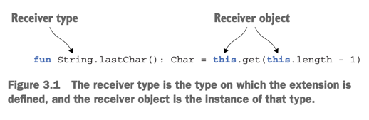
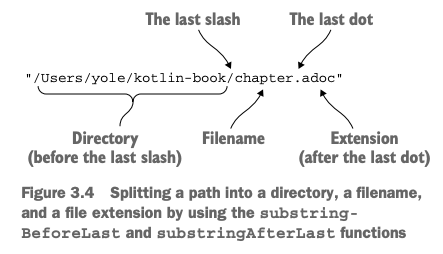

# 3. Defining and calling functions

1. Creating collections in Kotlin
2. Making functions easier to call
3. Adding methods to other people’s classes: extension functions and properties
4. Working with collections: varargs, infix calls, and library support
5. working with strings and regular expressions
6. Making your code tidy: local functions and extensions
7. Summary

> ### This chapter covers
>
> - collection, string, regular expression으로 함수 정의
> - named arguments, default parameter values, infix call 문법
> - extension functions and properties를 통해 Java 라이브러리 사용
> - top-level, local function, property 정의

---

## 1. Creating collections in Kotlin

```kotlin
val set = hashSetOf(1, 7, 53)
val list = arrayListOf(1, 7, 53)
val map = hashMapOf(1 to "one", 7 to "seven", 53 to "fifty-three")

println(set.javaClass) // class java.util.HashSet (Java의 getClass와 동일)
```

- Kotlin collection은 Java standard Java collection을 사용

## 2. Making functions easier to call

- 기본적으로 Collection은 `toString()` 메서드를 오버라이드하여 출력
- Guava, Apache Commons나 직접 커스터마이징 가능
- Kotlin은 standard library로 커스터마이징

```kotlin
fun <T> joinToString(
    collection: Collection<T>,
    separator: String,
    prefix: String,
    postfix: String
): String {
    val result = StringBuilder(prefix)
    for ((index, element) in collection.withIndex()) {
        if (index > 0) result.append(separator)
        result.append(element)
    }
    result.append(postfix)
    return result.toString()
}

val aespa = listOf("Karina", "Winter", "NingNing", "Giselle")
println(aespa.joinToString("; ", "(", ")"))
```

### Named arguments

```kotlin
val aespa = listOf("Karina", "Winter", "NingNing", "Giselle")
println(aespa.joinToString("; ", "(", ")"))
println(aespa.joinToString(separator = "; ", prefix = "(", postfix = ")"))
```

- Named arguments를 사용하여 함수 호출 시 인자의 이름을 명시적으로 지정 가능 (가독성 향상)

### Default parameter values

- 파라미터의 경우의수만큼 오버로딩해야하는 Java 문제를 해결
- Kotlin은 default parameter value를 지원
- 파라미터 순서대로 나열하되 중간에 생략하면 default value로 대체

```kotlin
val aespa = listOf("Karina", "Winter", "NingNing", "Giselle")
println(aespa.joinToString()) // Karina, Winter, NingNing, Giselle
println(aespa.joinToString(", ")) // Karina, Winter, NingNing, Giselle
````

> #### Default values and Java
>
> - Java에서는 default parameter value를 지원하지 않음
> - Java에서 Kotlin 함수를 호출할 때는 모든 파라미터를 명시적으로 지정해야함
> - `@JvmOverloads` annotation을 사용하여 Java에서도 default parameter value를 사용할 수 있음

### Getting rid of static uitility classes: top-level functions and properties

| Java                                               | Kotlin                                                                                |
|----------------------------------------------------|---------------------------------------------------------------------------------------|
| 무의미한 `Util` 클래스가 점점 거대해짐  e.g. `Collections` class | top-level function과 property를 사용하여 `Util` 클래스를 없앰<br/>static method를 위한 클래스 선언을 안해도 됨 |

- kotlin compiler가 top-level function이 담긴 파일명으로 class를 만듦
    - top-level function들은 static method가 됨

```java
/* Java */
package strings;

public class JoinKt {
    public static String joinToString() {
        // ...
    }
}
```

```kotlin
/* Kotlin */
package strings

fun joinToString() {
    // ...
}
```

```
/* Java */
import strings.JoinKt;

// ...
JoinKt.joinToString(list, ", ", "", "");
```

````
@file:JvmName("StringFunctions")

package strings

fun joinToString(...): String {
    ...
}

/* Java */
import strings.StringFunctions;
StringFunctions.joinToString(list, ", ", "", "");
````

#### TOP-LEVEL PROPERTIES

- function, proerty 모두 top-level로 선언 가능

```kotlin
package something

var ageKarina = 21 // static field
const val MAX_AGE = 100 // public static final int MAX_AGE = 100;

fun printAgeOfKarina() {
    println("Karina is $ageKarina years old")
}
```

## 3. Adding methods to other people’s classes: extension functions and properties

- Java와 Kotlin이 한 프로젝트에 함께 사용 가능
- _extension function_ : 클래스 밖에서 정의되어 클래스의 멤버처럼 호출 가능
    - body에서 private, protected 멤버에 접근 불가



```kotlin
package definingAndCallingFunctions

fun String.lastChar(): Char = this.get(this.length - 1) // this 생략 가능

fun main() {
    println("Kotlin".lastChar()) // n
}
```

- `String` : receiver type
- `"Kotlin"` : receiver object

### imports and extensions functions

- extension function을 사용하려면 import 필요
- `as` 키워드를 사용하여 이름 충돌 해결 가능
    - `import definingAndCallingFunctions.lastChar as last` : `last`로 호출

```kotlin
package definingAndCallingFunctions.innerPack

import definingAndCallingFunctions.lastChar

fun main() {
    println("Kotlin".lastChar())
}
```

### Calling extension functions from java

```java
public class Tmp {

    public static void main(String[] args) {
        System.out.println(ExExtensionKt.lastChar("Call Kotlin Extension Function"));
    }
}
```

### Utility functions as extensions

```kotlin
fun <T> Collection<T>.joinToString(separator: String = ", ", prefix: String = "", postfix: String = ""): String {
    val result = StringBuilder(prefix)
    for ((index, element) in this.withIndex()) {
        if (index > 0) result.append(separator)
        result.append(element)
    }
    result.append(postfix)
    return result.toString()
}

fun Collection<String>.join(separator: String = ", ", prefix: String = "", postfix: String = "") =
    joinToString(separator, prefix, postfix)
```

- Gneric을 사용하지 않고, 특정 타입만 지원하도록 할 수 있음

### No overriding for extension functions

- extension function은 overriding 불가

````kotlin
open class View {

    open fun show() {
        println("View.show() is called")
    }
}

fun View.outFun() {
    println("View.kt outFun() is called")
}

class Button : View() {

    override fun show() {
        println("Button.show() is called")
    }
}

fun Button.outFun() {
    println("Button.kt outFun() is called")
}

fun main() {
    val button: View = Button()
    button.show() // Button.show() is called

    val view: View = Button()
    view.outFun() // View.kt outFun() is called
}
```` 

- `outFun`은 `View` 클래스에 추가된 것이지만, `Button` 클래스에서 overriding 불가

### Extension properties

````kotlin
fun String.lastChar(): Char = this.get(this.length - 1) // extension function

val String.lastChar: Char get() = get(length - 1) // extension property

fun main() {
    println("Kotlin".lastChar())
    println("Aespa".lastChar)
}
````

- getter 함수를 정의하여 extension property를 만들 수 있음

## 4. Working with collections: varargs, infix calls, and library support

- `varags` : 함수가 임의의 개수의 인자를 받을 수 있도록 함
- _infix_ : 함수를 중위 호출로 사용 가능
- _Desturcturing declarations_ : 객체의 속성을 여러 변수에 할당 가능

### Extending the Java Collections API

- Java의 Collectiion API 확장
- `last()`, `maxOrNull()` 등의 함수를 사용할 수 있음 (**extension function**)

```kotlin

fun main() {
    val aespa: List<String> = listOf("Karina", "Giselle", "Winter", "Ningning")
    println(aespa.last())

    val numbers: Collection<Int> = setOf(1, 2, 3, 4, 5)
    println(numbers.maxOrNull())
}
```

### Varargs: functions that accept an arbitrary number of arguments

| Java                                                                                   | Kotlin                                                       |
|----------------------------------------------------------------------------------------|--------------------------------------------------------------|
| `...`<br/> `public void foo(String... strings) { ... }`<br/>모든 인자가 array에 패킹되어서 전달되어야함 | `varag` 접근제어자<br/> `fun foo(vararg strings: String) { ... }` |

```kotlin
package kotlin.collections

// ...

public fun <T> listOf(vararg elements: T): List<T> = if (elements.size > 0) elements.asList() else emptyList()
```

- _spread operator_ : 배열을 인자로 전달할 때 사용

```kotlin
val list = listOf("args: ", *args)
```

### Working with paris: infix calls and destructuring declarations

````
aespa to "Next Level"
newJeans to "Attention"

aespa.to("Next Level")
newJeans.to("Attention")
````

- `to` 함수는 infix 함수로 정의되어 있음
- _destructuring declaration_ : 객체의 속성을 여러 변수에 할당

```kotlin
package kotlin

public infix fun <A, B> A.to(that: B): Pair<A, B> = Pair(this, that)

// ...

fun main() {
    val (groupName, songName) = "aespa" to "Next Level" // destructuring declaration
    println("groupName: $groupName, songName: $songName")

    val groupWithLeader = mapOf("aespa" to "Karina", "Red Velvet" to "Irene", "NewJeans" to "Minzi")
    for ((group, leader) in groupWithLeader) {
        println("$leader is the leader of $group")
    }
}
```

## 5. working with strings and regular expressions

- Kotlin String은 Java String과 동일

### Splitting strings

```java
public class FromJava {

    public static void main(String[] args) {
        String[] arr = "12.345-6.A".split("."); // 파라미터로 정규표현식을 받음
        for (String s : arr) {
            System.out.println(s); // empty string
        }
    }
}
```

### Regular expressions and triple-quoted strings

```kotlin
fun main() {
    println("12.345-6.A".split("\\.|-".toRegex())) // [12, 345, 6, A]
    println("12.345-6.A".split(".", "-")) // [12, 345, 6, A]
}
```



```kotlin
fun main() {
    parsePath("/Users/yole/kotlin-book/chapter.adoc")
}

fun parsePath(path: String) {
    val directory = path.substringBeforeLast("/")
    val fullName = path.substringAfterLast("/")

    val fileName = fullName.substringBeforeLast(".")
    val extension = fullName.substringAfterLast(".")

    println("Dir: $directory, name: $fileName, ext: $extension")
}


fun parsePathRegex(path: String) {
    val regex = """(.+)/(.+)\.(.+)""".toRegex()
    val matchResult = regex.matchEntire(path)

    if (matchResult != null) {
        val (directory, fileName, extension) = matchResult.destructured
        println("Dir: $directory, name: $fileName, ext: $extension")
    }
}
```

- _triple-quoted string_ : 문자열 안에 escape 문자를 사용하지 않고 여러 줄을 포함할 수 있음
    - 즉 `\\.` 대신 `\.`로 사용 가능

### Multiline triple-quoted strings

- 개행 문자를 넣을 수 있음

```kotlin
val logoKotling = """| //
                        .|//
                        .|/ \"""

println(logoKotling.trimMargin("."))

println("""${'$'}99.9""") // $99.9
println("""C:\Users\yole\kotlin-book\chapter.adoc""") // C:\Users\yole\kotlin-book\chapter.adoc

```

- `trimMargin()` : 문자열의 각 줄에서 매개변수 문자열 앞에를 제거

## 6. Making your code tidy: local functions and extensions

- local function으로 코드 중복 제거
- 1번만 nesting하여 사용하기를 권고

```kotlin
class User(val id: Int, val name: String, val addr: String)

fun saveUser(user: User) {
    if (user.name.isEmpty()) {
        throw IllegalArgumentException("Can't save user ${user.id}: empty Name")
    }

    if (user.addr.isEmpty()) {
        throw IllegalArgumentException("Can't save user ${user.id}: empty Address")
    }

    // Save user to the database
}


fun saveUserWithLocalFunction(user: User) {
    fun validate(value: String, fieldName: String) {
        if (value.isEmpty()) {
            throw IllegalArgumentException("Can't save user ${user.id}: empty $fieldName")
        }
    }

    validate(user.name, "Name")
    validate(user.addr, "Address")

    // Save user to the database
}
```

## 7. Summary

- Kotlin collection은 Java standard Java collection을 사용
    - 확장해서 사용
- default parameter value를 사용해 오버로딩 줄임
    - named arguments를 사용하여 가독성 향상
- extension function(property) : class 밖의 file 자체에 추가
- infix function으로 operator-like한 메서드 선언 가능
- Kotlin은 String 타입을 다루는 여러 편리한 함수를 제공
- Tirple-qutoed string을 사용하면 이스케이핑 처리 필요 없음
- local function을 사용하여 코드 중복 제거
    - 1번만 nesting하여 사용하기를 권고