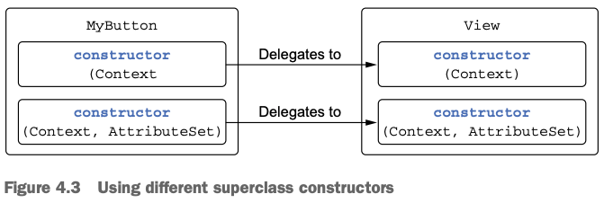
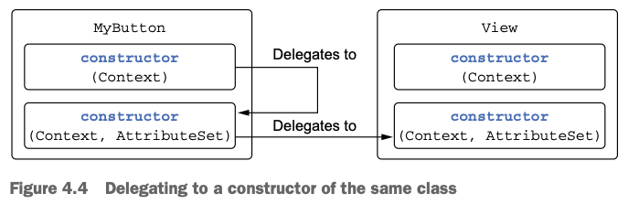

# 4.Classes, objects, and interfaces

1. Defining class hierarchies
2. Declaring a class with nontrivial constructors or properties
3. Compiler-generated methods: data classes and class delegation
4. The "object" keyword: declaring a class and creating an instance, combined
5. Summary

> ### This chapter covers
>
> - 클래스, 인터페이스
> - Nontrivial constructors, properties¬
> - Data 클래스
> - Class delegation
> - `object` 키워드

---

## 1. Defining class hierarchies

- class 계층 구조
- Kotlin의 visiblity, access modifier
- `sealed` class

### Interfaces in Kotlin

| Java                    | Kotlin                    |
|-------------------------|---------------------------|
| `interface`             | `interface`               |
| `implements`, `extends` | `:`                       |
| `@Override`             | `override` (**required**) |

- Java 8 인터페이스와 비슷
- abstract method, non-abstract method 모두 정의 가능 (Java 8의 default method)
- `interface` keyword 로 선언

```kotlin
interface Clickable {
    fun click()
}

class Button : Clickable {
    override fun click() = println("I was clicked")
}
```

````kotlin
interface Clickable {
    // default method
    fun click() {
        println("Clickable clicked")
    }
}
````

```kotlin
interface Clickable {
    fun click() {
        println("Clickable clicked")
    }

    fun showOff() = println("I'm clickable!")
}

class Button : Clickable,
    Focusable { // compile error : Class 'Button' must override public open fun showOff(): Unit defined in classesObjectsAndInterfaces.Clickable because it inherits multiple interface methods of it
    override fun click() {
        println("Button clicked")
    }
}

interface Focusable {
    fun setFocus(b: Boolean) = println("I ${if (b) "got" else "lost"} focus.")
    fun showOff() = println("I'm focusable!")
}
```

```kotlin

interface Clickable {
    fun click() {
        println("Clickable clicked")
    }

    fun showOff() = println("I'm clickable!")
}

class Button : Clickable, Focusable {
    override fun click() {
        println("Button clicked")
    }

    override fun showOff() {
        super<Clickable>.showOff()
        super<Focusable>.showOff()
    }
}

interface Focusable {
    fun setFocus(b: Boolean) = println("I ${if (b) "got" else "lost"} focus.")
    fun showOff() = println("I'm focusable!")
}

```

### Open, final and abstract modifiers: final by default

- Java는 모든 클래스의 subclass 생성을 허용
    - _fragile base class_ : `final` 키워드가 없는 멤버들은 subclass에서 override 가능
- _fragile base class_ problem : 정확한 override 방법을 제공하지 않으면, 오버라이딩 시 문제 발생 가능성 있음
- _Effective Java_ 저자 Joshua Bloch : 모든 클래스를 `final`로 선언하라고 권장
    - 즉, 웬만하면 상속을 금하라
- 같은 목적으로 Kotlin은 `final` 이 default
    - `open` 키워드로 상속을 허용

```kotlin
// open class : 상속을 허용
open class RichButton : Clickable {

    // final method : override 금지
    fun disable() {}

    // open method : override 허용
    open fun animate() {}

    // override method : open (final 추가하면 비허용)
    override fun click() {}
}
```

```kotlin
// asbtract class : cannot be instantiated
abstract class Animated {
    // abstract function : must be overridden in subclasses
    abstract fun animate()

    // open function
    open fun stopAnimating() {}

    // This function is final and cannot be overridden in subclasses
    fun animateTwice() {}
}
```

### Visibility modifiers: public by default

| Java                        | Kotlin             |
|-----------------------------|--------------------|
| defualt : `package-private` | defualt : `public` |

- Visibility modifier : control access `public`, `internal`, `protected`, `private`
- defualt : `public`
- `internal` : module 내부에서만 접근 가능
- `private` 을 top-level 로 선언 가능 (class, function, property, etc.)
    - top-level `private` 은 해당 file 내에서만 접근 가능
- `protected` : class 내부나 subclass에서만 접근 가능 (Java와 다름)

```kotlin
internal open class TalkativeButton : Focusable {
    private fun yell() = println("Hey!")
    protected fun whisper() = println("Let's talk!")
}


fun TalkativeButton.giveSpeech() { // compile error : fun이 internal이거나, class가 public이어야 함
    yell() // compile error : private function
    whisper() // compile error : protected function
}
```

> #### Kotilin's visibility modifiers and java
>
> - `private` class는 컴파일 시 `package-private`로 변경
> - `internal` class는 컴파일 시 `public`으로 변경
> - 따라서 Java에서는 `internal` class에 접근 가능
> - 그러나, 복잡해지고, 충돌이 일어날 수 있으니 하지말 것

### Inner and nested classes: nested by default


- Kotlin은 outer class 인스턴스에 기본적으로 접근 불가능

```kotlin
import java.io.Serializable

interface State : Serializable

interface View {
    fun getCurrentState(): State
    fun restoreState(state: State) {}
}
``` 

```java

public class Button implements View {

    @Override
    public State getCurrentState() {
        return new ButtonState();
    }

    @Override
    public void restoreState(@NotNull State state) {
        // ...
    }

    public class ButtonState implements State {
        // ...
    }


    public static void main(String[] args) throws IOException {
        State buttonState = new ButtonJava().getCurrentState();

        byte[] serializedButtonState;
        try (ByteArrayOutputStream baos = new ByteArrayOutputStream()) {
            try (ObjectOutputStream oos = new ObjectOutputStream(baos)) {
                oos.writeObject(buttonState); // Error: java.io.NotSerializableException !
                baos.toByteArray();
            }
        }
    }
}
```

- Java의 **문제점** `ButtonState` 타입의 인스턴스를 직렬화할때 `java.io.NotSerializableException` 발생
    - 원인 : `ButtonState`는 `Button`의 인스턴스에 대한 참조를 가지고 있음
    - 해결방법 : `ButtonState`를 `static`으로 선언해서 외부 클래스에 대한 암묵적 참조를 제거

```kotlin
class ButtonKt : View {
    override fun getCurrentState(): State = ButtonState()
    override fun restoreState(state: State) {
        // ...
    }

    // static nested class
    class ButtonState : State {
        // ...
    }
}
```

- `inner` 키워드를 사용하면 외부에 참조하는 Java 처럼 동작
- `inner` 키워드를 사용하지 않으면 `static` 처럼 동작

````kotlin
class Outer {
    inner class Inner {
        fun getOuterReference(): Outer = this@Outer
    }
}
````

### Sealed classes: defining restricted class hierarchies

```kotlin
interface Expr
class Num(val value: Int) : Expr
class Sum(val left: Expr, val right: Expr) : Expr

fun eval(e: Expr): Int =
    when (e) {
        is Num -> e.value
        is Sum -> eval(e.right) + eval(e.left)
        else -> // else 로 default case를 처리해야 함 (compile check)
            throw IllegalArgumentException("Unknown expression")
    }
````

- `sealed` class : class 계층 구조를 제한
    - `open`


```kotlin
sealed class Expr {
    class Num(val value: Int) : Expr()
    class Sum(val left: Expr, val right: Expr) : Expr()
}

fun eval(e: Expr): Int =
    when (e) {
        is Expr.Num -> e.value
        is Expr.Sum -> eval(e.right) + eval(e.left) // else 불필요
    }
```

- `sealed` class는 자신의 nested class만 상속 가능
    - `sealed` class에 클래스가 추가되면, 컴파일러는 모든 하위 클래스를 검사해서 `when` 식이 모든 경우를 다루는지 확인 (compile error)

## 2. Declaring a class with nontrivial constructors or properties

- _primary constructor_ : 클래스 선언과 함께 정의 (class body 바깥에)
- _secondary constructor_ : 클래스 내부에 정의
- _initializer block_ : 초기화 블록

### Initializing classes: primary constructor and initializer blocks

```kotlin
class User(val nickname: String)

// primary constructor를 풀어서 표현 (위와 동일)
class User constructor(_nickname: String) {
    val nickname: String

    // initializer block
    init {
        nickname = _nickname
    }
}

class User(_nickname: String) {
    val nickname = _nickname
}

class User(val nickname: String)
```

- `{}` 없음
- `()` : _primary constructor_ (`(val nickname: String)`)
- `constructor` 키워드 : priamry (secondary) constructor를 정의할 때 사용
- `init` 키워드 : _initializer block_ 을 정의
    - class가 생성될 때 primary constructor가 먼저 실행되고, 그 다음에 initializer block이 실행됨
-
    * 만일 모든 파라미터가 default value가 있으면, 컴파일러는 파라미터가 없는 생성자를 자도으로 생성

```kotlin
open class User(val nickname: String) {
    // ...
}
class TwitterUser(nickname: String) : User(nickname) {
    // ...
}
```

- sub-class는 super-class의 생성자 파라미터를 명시적으로 호출해야 함

```kotlin
open class Button

class RadioButton : Button()
```

- 생성자가 없으면, 파라미터가 없는 생성자가 default constructor로 생성됨
- interface는 생성자가 없으므로 sub-class에서 super-class 생성자를 호출할 필요가 없음

```kotlin
class Secretive private constructor() {}
```

- `private` 으로 인스턴스화 금지
    - single tone을 위한거면 Kotlin top-level 클래스를 사용하는 것이 좋음

### Secondary constructors: initializing the superclass in different ways

- Kotlin은 default parameter value를 지원 -> 생성자 오버로딩을 줄일 수 있음
- Kotlin에서 생성자 오버로딩이 필요한 경우 : 서로 다른 방법으로 클래스를 초기화하는 방법을 제공해야하는 sub-class를 만들 때



```kotlin
open class View {
    constructor(ctx: Context) {
        // some code
    }
    constructor(ctx: Context, attr: AttributeSet) {
        // some code
    }
}
class MyButton : View {
    constructor(ctx: Context)
            : super(ctx) {
        // ...
    }
    constructor(ctx: Context, attr: AttributeSet)
            : super(ctx, attr) {
        // ...
    }
}
```



```kotlin
class MyButton : View {
    constructor(ctx: Context)
            : this(ctx, MY_STYLE) {
        // ...
    }
    constructor(ctx: Context, attr: AttributeSet)
            : super(ctx, attr) {
        // ...
    }
}
```

### Implementing properties declared in interfaces

```kotlin
interface User {
    val nickname: String
}

// primary constructor
class PrivateUser(override val nickname: String) : UserInf

// custom getter
class SubscribingUser(val email: String) : UserInf {
    override val nickname: String
        get() = email.substringBefore('@')
}

// property initializer
class FacebookUser(val accountId: Int) : UserInf {
    override val nickname = getFacebookName(accountId)
}
```

- `User` 구현체는 `nickname` property를 제공해야 함
- `PrivateUser` : primary constructor를 통해 property를 제공 (`override` 키워드)
- `SubscribingUser` : custom getter를 통해 property를 제공
    - value를 저장하기 위한 backing field 없이 **getter() 호출마다** 값을 계산, 리턴
- `FacebookUser` : property initializer를 통해 property를 제공
    - property를 초기화하는 코드를 property 선언에 직접 넣음

````kotlin
interface User {
    val email: String // abstract property
    val nickname: String
        get() = email.substringBefore('@') // custom getter (default implementation)
}
````

### Accessing a backing field from a getter or setter

- backing field : property의 값을 저장하는 field
- 두 종류의 property
    - 종류 1. value를 저장하는 property
    - 종류 2. custome accesor 를 통해서 매번 호출마다 값을 계산하는 property
- 종류 2가지를 합쳐서 매번 계산하여 값을 저장하는 property를 만들 수 있음

```kotlin

class User(val name: String) {
    var address: String = "unspecified"
        set(value: String) {
            println(
                """
                Address was changed for $name:
                "$field" -> "$value".""".trimIndent()
            )
            field = value // update backing field
        }
}

fun main() {
    User("Alice").address = "Elsenheimerstrasse 47, 80687 Muenchen" // Address was changed for Alice:
    // "unspecified" -> "Elsenheimerstrasse 47, 80687 Muenchen".

}
```

### Changing accessor visibility

```kotlin
class LengthCounter {
    var counter: Int = 0
        private set // the setter is private and has no backing field

    fun addWord(word: String) {
        counter += word.length
    }
}

fun main() {
    val lengthCounter = LengthCounter()
    lengthCounter.addWord("Hi!")
    println(lengthCounter.counter) // 3
}
```

## 3. Compiler-generated methods: data classes and class delegation

- `equals`, `hashCode`, `toString` 등의 메서드들이 중복으로 오버라이딩 되어있음
- kotlin compiler는 뒤에서 자동으로 생성해줌 (코드 작성 X)

### Universal object methods

### Data classes: autogenerated implementations of universal methods

### Class delegation: using the "by" keyword

## 4. The "object" keyword: declaring a class and creating an instance, combined

### Object declarations: singletons made easy

### Companion objects: a place for factory methods and static members

### Companion objects as regular objects

### Object expressions: anonymous inner classes rephrased

## 5. Summary
