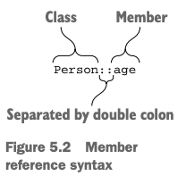

# 5. Programming with lambdas

1. Lamda expressions and member references
2. Functional APIs for collections
3. Lazy collection operations: sequences
4. Using Java functional interfaces
5. Lanmdas with receiver: "with" and "apply"
6. Summary

> ### This chapter covers
>
> - Lambda expressions and member references
> - funcitonal style로 collection을 다루는 방법
> - Sequences : lazy collection operations
> - Java functional interfaces 사용
> - receiver를 사용한 lamda

---

## 1. Lambda expressions and member references

### Introduction to lamdas: blocks of code as function parameters

- "event 가 발생하면 이 handler를 실행해라" 라는 코드를 작성할 때, handler를 lamda로 표현 가능
    - 이전 Java에서는 anonymous class를 사용했음
- funtional-programming : funtion을 value처럼 다루는 것
- lamda : funciton을 선언하지 않아도, value처럼 그떄그떄 생성해서 전달 가능

```
button.setOnCLickListner (new OnClickListener() {
    @Override
    public void onClick(View v) {
        Log.d(TAG, "Button clicked");
    }
});

// lamda
button.setOnClickListener { Log.d(TAG, "Button clicked") }
```

### Lamdas and collections

```kotlin
fun main() {
    val peoples = listOf(Person("Alice", 29), Person("Bob", 31))
    findTheOldest(peoples)

    // with kotlin lamda
    println(peoples.maxBy { it.age })
    println(peoples.maxBy(Person::age))  // member reference
}

data class Person(val name: String, val age: Int)

fun findTheOldest(peoples: List<Person>) {
    var maxAge = 0
    var theOldest: Person? = null
    for (person in peoples) {
        if (person.age > maxAge) {
            maxAge = person.age
            theOldest = person
        }
    }
    println(theOldest)
}
```

- `{ it.age }` : lamda expression

### Syntax for lamda expressions


````
val sumEx = { x: Int, y: Int -> x + y }
println(sumEx(1, 2))

println({x: Int, y: Int -> x + y}(1, 2)) // Redundant lambda creation (bad)
 
run{println(42)} // run the code in the lambda

println(peoples.maxBy(){p: Person -> p.age}) // explicit type
println(peoples.maxBy{p: Person -> p.age}) // explicit type

println(peoples.maxBy{p -> p.age}) // implicit type
println(peoples.maxBy{it.age}) // implicit type (it : default parameter name)
````

### Accessing variables in scope

- lamda가 선언된 바깥의 변수를 사용할 수 있음

```kotlin
fun printMsgWithPrefix(msg: Collection<String>, prefix: String) {
    msg.forEach {
        println("$prefix $it")
    }
}


fun printProblemCounts(responses: Collection<String>) {
    var clientErrors = 0
    var serverErrors = 0
    responses.forEach {
        if (it.startsWith("4")) {
            clientErrors++ // non-final variable에 접근 가능
        } else if (it.startsWith("5")) {
            serverErrors++ // non-final variable에 접근 가능
        }
    }
    println("$clientErrors client errors, $serverErrors server errors")
}
```

```kotlin
fun tryToCountButtonClicks(button: Button): Int {
    var clicks = 0
    button.onClick { clicks++ }
    return clicks
}
```

- 주의점 : 람다 안에서 변수 수정은 람다가 실행될 때만 일어남
- 위에서 `onClick` handler는 `tryToCountButtonClicks` 가 return 되고 난 후에 호출됨

### Member references



```kotlin
val getAge = Person::age

// same as
val getAge = { person: Person -> person.age }
````

- `::` : function 을 value로 사용할 수 있게 함

```kotlin
fun salute() = println("Salute!")
fun main() {
    run(::salute) // top level function reference
}
```

- _constructor reference_ : `::` 뒤에 생성자를 사용할 수 있음

```kotlin
// constructor reference
val createPerson = ::Person
val p = createPerson("Alice", 29)
println(p)

val aliceAgeFunc = p::age // bound method reference
println(aliceAgeFunc())
```

## 2. Functional APIs for collections

- collection을 다루기 위한 Kotlin standard library의 함수들

### Essentials: filter and map

- `filter` : collection의 element를 걸러내는 함수
- `map` : collection의 element를 변환하는 함수
    - 기존 collection을 변경하지 않고, 새로운 collection을 반환

```kotlin
val list = listOf(1, 2, 3, 4)

println(list.filter { it % 2 == 0 }) // [2, 4], return a new list
println(list.map { it * it }) // [1, 4, 9, 16], return a new list

val idols = listOf(Idol("Karina", 23), Idol("Giselle", 24), Idol("Winter", 22), Idol("Ningning", 20))
println(idols.filter { it.age > 20 }.map { it.name }) // 20살 이상인 아이돌의 이름만 출력
```

### "all", "any", "count", and "find": applying a predicate to a collection

```kotlin
val isAdult = { p: Idol -> p.age > 20 }

println(idols.all(isAdult)) // false
println(idols.any(isAdult)) // true
println(idols.count(isAdult)) // 3
```

#### `count` vs `size`

- `count` : predicate를 만족하는 element의 개수를 반환
- `size` : size를 알아내기위해 임시 collection을 만들어서 size를 반환

```kotlin
println(idols.filter(isAdult).size) // 3 (create a new list and count the size)
println(idols.count(isAdult)) // 3 (count the number of elements that satisfy the predicate)
````

---

```kotlin
println(idols.find { it.name == "Karina" }) // Idol(name=Karina, age=23)
println(idols.find { it.age > 20 }) // first element that satisfy the predicate
```

### groupBy: converting a list to a map of groups

```kotlin
val idols2 = listOf(
    Idol("Karina", 23), Idol("Giselle", 23),
    Idol("Minzi", 22), Idol("Alice", 23),
    Idol("Winter", 22)
)

println(idols2.groupBy { it.age }) // Map<Int, List<Idol>>
```

### flatMap and flatten: processing elements in nested collections

```kotlin
val memberAespa = listOf(
    Member("Karina", 23), Member("Giselle", 23),
    Member("Winter", 22), Member("Ningning", 20)
)

val memberRedVelvet = listOf(
    Member("Irene", 30), Member("Seulgi", 28),
    Member("Wendy", 27), Member("Joy", 25),
    Member("Yeri", 23)
)

val groupIdols = listOf(
    GroupIdol("aespa", memberAespa),
    GroupIdol("Red Velvet", memberRedVelvet)
)

println(groupIdols.flatMap { it.members }
    .map { it.name }) // [Karina, Giselle, Winter, Ningning, Irene, Seulgi, Wendy, Joy, Yeri]

val strings = listOf("abc", "def")
println(strings.flatMap { it.toList() }) // [a, b, c, d, e, f]

val list2 = listOf(listOf(1, 2, 3), listOf(4, 5, 6))
println(list2.flatten()) // [1, 2, 3, 4, 5, 6]
```

- `flatMap` = _transform_ -> _flatten_
    - _transform_ : 각 element를 주어진 함수를 통해 변환
    - _flatten_ : 변환된 결과를 하나의 list로 합침
- `flatten` : nested collection을 하나의 collection으로 합침

## 3. Lazy collection operations: sequences

- `filter()` : _eagerly_
    - 각 step 마다의 결과를 임시 list에 저장
- _Sequences_ : _lazily_
    - 각 step 마다의 결과를 저장하지 않고, 다음 step으로 넘어감
    - 임시 저장 객체 없음
    - 주의 : element가 많을 떄만 사용
    - Java Stream API

```kotlin
// eager
idols.map(Idol::name) // return a new list
    .filter { it.startsWith("K") } // return a new list
    .forEach(::println) // Karina

// lazy
idols.asSequence() // convert the list to a sequence
    .map(Idol::name)
    .filter { it.startsWith("K") }
    .forEach(::println) // Karina
```

- `asSequence()` : list를 sequence로 변환

### Executing sequence operations: intermediate and terminal operations


- _intermediate operation_ : sequence를 반환
- _terminal operation_ : sequence를 실행하고 결과 반환

```kotlin
listOf(1, 2, 3, 4).asSequence()
    .map { print("map($it) "); it * it }
    .filter { print("filter($it) "); it % 2 == 0 }
    .toList() // terminal operation : 실행
```


```kotlin
idols.map(Idol::name) // map first
    .filter { it.startsWith("K") }
    .forEach(::println)

// lazy하게 실행하면 map 연산 수가 줄어듦
idols.asSequence()
    .filter { it.name.startsWith("K") }
    .map(Idol::name)
    .forEach(::println)
```

### Creating sequences

```kotlin
val naturalNumbers = generateSequence(0) { it + 1 }
val numbersTo100 = naturalNumbers.takeWhile { it <= 100 }
val sum = numbersTo100.sum() // sum() is a terminal operation

fun File.isInsideHiddenDirectory() =
    generateSequence(this) { it.parentFile }.any { it.isHidden }

val file = File("/Users/svtk/.HiddenDir/a.txt")
println(file.isInsideHiddenDirectory())
```

## 4. Using Java functional interfaces

### Passing a lamda as a parameter to a Java method

### SAM constructors: explicit conversion of lamdas to functional interfaces

## 5. Lanmdas with receiver: "with" and "apply"

### The "with" function

### The "apply" function

## 6. Summary