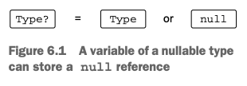
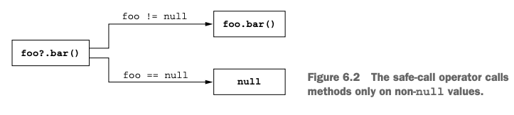
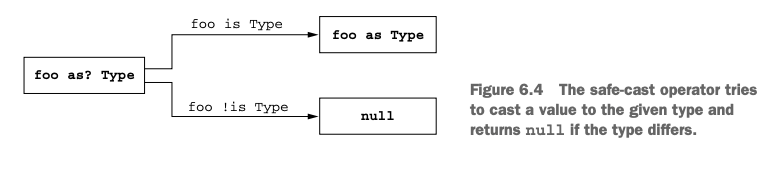
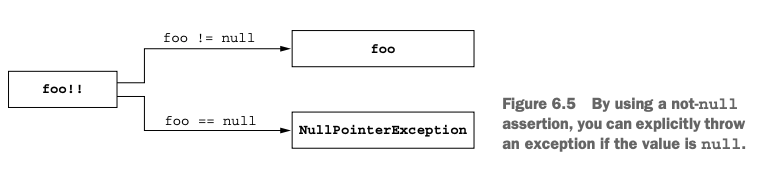
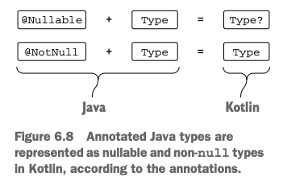
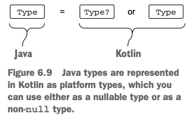

# 6. The Kotlin type system

1. Nullability
2. Primitive and other basic types
3. Collections and arrays
4. Summary

> ### This chapter covers
>
> - Nullable types, `null`
> - Primitive types, Java와 대응
> - Kotlin collections and Java

---

## 1. Nullability

- modern language는 NPE를 runtime에서 compile-time으로 옮기는 방향으로 발전

### Nullable types



- Kotlin은 명시적으로 _nullable type_을 지원
    - null 허용 여부를 type에 명시적으로 표시

```kotlin
fun strLen(s: String) = s.length

strLen(null) // compile error

fun strLenSafe(s: String?) = s?.length ?: 0
```

### THe meaning of types

- type이란, 해당 타입에 가능한 값과 연산의 집합
- java의 String은 null이거나 String instance를 가질 수 있음
    - `instanceof`로 null 여부를 확인해야 함
    - `@NotNull`, `Optional` 등 사용 가능
- nullable, not-null 은 런타임에는 타입이 동일
    - 컴파일 타임에 null 여부를 체크

### Safe call operator: `?.`



- `?.` = `null` check + operation
- `s?.length` = `if (s != null) s.length else null`

### Elvis operator: `?:`

- `?:` = `null` check + default value

```kotlin
fun strLenSafe(s: String?) = s?.length ?: 0

fun printShippingLabel(person: Person) {
    val address = person.company?.address
        ?: throw IllegalArgumentException("No address")
    with(address) { // address is not null
        println(streetAddress)
        println("$zipCode $city, $country")
    }
}
```

### Safe casts: `as?`



- `as` : cast 실패 시 `ClassCastException` 발생
- `as?` : cast 실패 시 `null` 반환

```kotlin
class Person(val firstName: String, val lastName: String) {
    override fun equals(o: Any?): Boolean {
        val otherPerson = o as? Person ?: return false
        return otherPerson.firstName == firstName &&
                otherPerson.lastName == lastName
    }

    override fun hashCode(): Int =
        firstName.hashCode() * 37 + lastName.hashCode()
}
```

### Not-null assertion: `!!`



- `!!` : `null`이 아님을 단언
- function 호출 전에 null 체크를 했을 경우 유용
- 2개 이상의 `!!` 을 사용하지 말 것
    - exception이 발생한 경우, 어디서 발생했는지 추적이 어려움 (line number를 추적함)

```kotlin
fun ignoreNulls(s: String?) {
    val notNullS: String = s!!
    println(notNullS.length)
}

ignoreNulls(null) // NPE

person.company!!.address!!.city // bad practice (NPE 발생 시 뭐가 null인지 추적 어려움)
```

### The `let` function

- null인지 체크하고, 변수에 저장하는 것을 하나의 표현식으로 처리

```
fun sendEmailTo(email: String) { /*...*/ }

if(email != null) sendEmailTo(email)

email?.let { sendEmailTo(it) }
```

### Late initialized properties

- Junit `@Before` 에 초기화 로직 삽입
- non-null property를 생성자에 놓고싶으면 non-null 이니셜라이저 필요
- late-initialized property는 non-null이지만 초기화를 나중에 할 수 있음 (생성자 밖에서)
    - `var`로 선언해야함
    - 생성자 안에서 초기화할 필요 없음

```kotlin
class MyService {
    fun performAction(): String = "foo"
}

// bad
class MyTest {
    private var myService: MyService? = null

    @Before
    fun setUp() {
        myService = MyService()
    }

    @Test
    fun testAction() {
        assertEquals("foo", myService!!.performAction()) // 접근할 떄마다 !! 사용
    }
}

// good
class MyTest {
    private lateinit var myService: MyService

    @Before
    fun setUp() {
        myService = MyService()
    }

    @Test
    fun testAction() {
        assertEquals("foo", myService.performAction()) // lateinit property는 non-null
    }
}
```

### Extensions for nullable types

- nullable type에 대한 확장 함수 정의 가능
- 확장 함수 안에서 `this` 는 nullable type
    - Java의 `this`는 non-null

```kotlin
fun String?.isNullOrBlank(): Boolean = this == null || this.isBlank()

fun verifyUserInput(input: String?) {
    if (input.isNullOrBlank()) { // nullable type에 대한 확장 함수, safe call operator 필요 없음
        println("Please fill in the required fields")
    }
}
```

### Nullability of type parameters

```kotlin
fun <T> printHashCode(t: T) { // T는 nullable (Any?와 동일)
    println(t?.hashCode())
}

fun <T : Any> printHashCode(t: T) { // T는 non-null
    println(t.hashCode())
}
```

### Nullability and Java



- Java의 `@Nullable Stirng` 은 Kotlin의 `String?`과 동일

#### PLATFORM TYPES



- Java의 null이 될 수 있는 타입을 Kotlin에서 사용할 때, `String`과 `String?` 중 어떤 것을 사용할지 결정해야 함

```java
public class Person {
    private final String name;

    public Person(String name) {
        this.name = name;
    }

    // return nullable type
    public String getName() {
        return name;
    }
}
```

```kotlin
fun yellAt(person: Person) {
    println(person.name.toUpperCase() + "!!!") // throw NPE
}

fun yellAt(person: Person) {
    println((person.name ?: "Anyone").toUpperCase() + "!!!")
}
```

#### INHERITANCE

- Java method를 오버라이딩할 때 파라미터와 리턴 타입이 nullable인지 여부를 고려해야 함

```java
public class StringProcessor implements Processor<String> {
    @Override
    public String process(String value) {
        return value.toUpperCase();
    }
}
```

```kotlin
class StringPrinter : Processor<String> {
    override fun process(value: String): String = value.toUpperCase()
}

class NullableStringPrinter : Processor<String?> {
    override fun process(value: String?): String = value?.toUpperCase() ?: ""
}
```

## 2. Primitive and other basic types

- kotlin은 primitive 와 wrapper type을 구분하지 않음

### Primitive types: Int, Boolean, and more

- Java _primitive type_ : 변수에 값을 곧장 저장
- Java _reference type_ : 변수에 객체의 참조를 저장
- Java _wrapper type_ : primitive type을 객체로 감싼 것
- Kotlin은 primitive type과 wrapper type을 구분하지 않음
- Kotlin은 런타임에 대부분의 wrapper 타입을 Java primitive type으로 컴파일
    - collection과 같은 제네릭 클래스의 경우만 예외

```kotlin
val i: Int = 1
val list: List<Int> = listOf(1, 2, 3)
```

### Nullable primitive types: Int? Boolean? and more

- Kotlin에서 nullable primitive type은 wrapper type으로 컴파일

```kotlin
val listOfInts = listOf(1, 2, 3) //Java List<Integer>
```

### Number conversions

- Kotlin은 더 큰 타입일지라도 자동으로 변환하지 않음
    - boxed value를 자동으로 변환하다 발생하는 에러 방지
- 모든 primitive type마다 conversion function을 제공 (Boolean 제외)

```kotlin
val i = 1
// val l: Long = i // compile error
val l: Long = i.toLong() // use conversion function
```

### `Any`, `Any?`: the root types

- `Any` : Java의 non-nullable type의 supertype
    - Java의 `Object`에 대응
- `Any?` : nullable type의 supertype

```kotlin
val answer: Any = 42 // answer is non-nullable
```

### The Unit type: Kotlin's 'void'

````
fun f(): Unit {...} // Unit 생략 가능
````

- Java의 `void` function에 대응

```kotlin
interface Processor<T> {
    fun process(): T
}
class NoResultProcessor : Processor<Unit> {

    // 명시적으로 return type을 지정할 필요가 없음
    override fun process() {
        // no result
        // comipler가 return Unit을 추가함
    }
}

```

### The Nothing type: "This function never returns"

```kotlin
fun fail(message: String): Nothing {
    throw IllegalStateException(message)
}

val address = company.address ?: fail("No address")
println(address.city) // compiler가 address가 non-null로 추론함, null이면 fail이기 떄문
```

## 3. Collections and arrays

## 4. Summary
