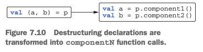

# 7. Operator overloading and other conventions

1. Overloading arithmetic operators
2. Overloading comparison operators
3. Conventions used for collections and ranges
4. Destructuring declarations and component functions
5. Reusing property accessor logic: delegated properties
6. Summary

> ### This chapter covers
>
> - Operator overloading
> - Conventions : 다양한 operation을 지원하는 special-named functions
> - Delegated properties

---

- class에 `plus` method를 정의하면 `+` operator를 사용 가능
- _convention_ : `plus` method를 정의하면 `+` operator를 사용 가능

```kotlin
data class Point(val x: Int, val y: Int) 
```

## 1. Overloading arithmetic operators

- primitive type에 대해 arithmetic operators를 사용 가능
- `+` 는 String도 가능

### Overloading binary arithmetic operations

| Expression | Function name |
|------------|---------------|
| a + b      | `plus`        |
| a - b      | `minus`       |
| a * b      | `times`       |
| a / b      | `div`         |
| a % b      | `mod`         |

```kotlin
fun main() {
    val p1 = Point(10, 20)
    val p2 = Point(30, 40)
    println(p1 + p2)

    val p3 = Point(10, 20)
    println(p3 * 1.5)

    val p4 = Point(10, 20)
    println(1.5 * p4)
}
data class Point(val x: Int, val y: Int) {
    operator fun plus(other: Point): Point {
        return Point(x + other.x, y + other.y)
    }

    operator fun times(scale: Double): Point {
        return Point((x * scale).toInt(), (y * scale).toInt())
    }
}

// extension function
operator fun Point.plus(other: Point): Point {
    return Point(x + other.x, y + other.y)
}

operator fun Double.times(p: Point): Point {
    return Point((p.x * this).toInt(), (p.y * this).toInt())
}

```

### Overloading compound assignment operators

```kotlin
var p6 = Point(1, 2)
p6 += Point(3, 4)
println(p6) // Point(x=4, y=6)

var l1 = ArrayList<Int>()
l1 += 42
println(l1) // [42]

val p7 = Point(10, 20)
p7 += Point(30, 40) // compile error : Val cannot be reassigned

val l2 = arrayListOf(1, 2)
l2 += 3

val newList = l2 + listOf(4, 5)
```

- _compound assignment operators_ : `+=`, `-=`, `*=`, `/=`, `%=` 등
- `+=` : `plusAssign`, `-=` : `minusAssign`, `*=` : `timesAssign`, `/=` : `divAssign`, `%=` : `modAssign`

```kotlin
// kotlin standard library
operator fun <T> MutableCollection<T>.plusAssign(element: T) {
    this.add(element)
}
```

### Overloading unary operators

| Expression | Function name |
|------------|---------------|
| +a         | `unaryPlus`   |
| -a         | `unaryMinus`  |
| !a         | `not`         |
| ++a, a++   | `inc`         |
| --a, a--   | `dec`         |

```kotlin
fun main() {
    val p7 = Point(10, 20)
    println(-p7) // Point(x=-10, y=-20)

    var bd = BigDecimal.ZERO
    println(bd++) // 0
    println(++bd) // 2
}
data class Point(val x: Int, val y: Int) {
    //...
    operator fun unaryMinus(): Point {
        return Point(-x, -y)
    }
}

operator fun BigDecimal.inc() = this + BigDecimal.ONE
```

## 2. Overloading comparison operators

- comparison operators : `==`, `!=`, `<`, `>`, `<=`, `>=`

### Equality operators: `equals`

- kotlin의 `==`, `!=`는 `equals`를 호출

```kotlin
class Point(val x: Int, val y: Int) {
    override fun equals(obj: Any?): Boolean {
        if (obj === this) return true
        if (obj !is Point) return false
        return obj.x == x && obj.y == y
    }
}

println(Point(10, 20) == Point(10, 20)) // true
println(Point(10, 20) != Point(5, 5)) // true
println(null == Point(1, 2)) // false
```

- `===` : _identity equals_ operator
    - reference equality를 확인

### Ordering operators: `compareTo`

- Java에서 Object 비교 (정렬, 크기 등)를 위해선 명시적으로 `compareTo`를 구현, 호출해야함
- `compareTo`는 `==`, `<`, `>`, `<=`, `>=`를 사용 가능하게 함
- Kotlin은 `Comparaable` 구현체에 대해 convention을 제공
    - `compareTo`를 구현하면 `==`, `<`, `>`, `<=`, `>=`를 사용 가능

```kotlin
class Person(
    val firstName: String, val lastName: String
) : Comparable<Person> {
    override fun compareTo(other: Person): Int {
        return compareValuesBy(
            this, other,
            Person::lastName, Person::firstName
        )
    }
}

fun main() {
    val person1 = Person("Alice", "Smith")
    val person2 = Person("Bob", "Johnson")
    println(person1 < person2) // false
}
```

- `compareValuesBy` : `compareTo`를 구현하는데 도움을 주는 함수
    - 여러 field를 순차적으로 비교

## 3. Conventions used for collections and ranges

- _index operator_ : `[]`
- `in` operator : contains, range, iteration

### Accessing elements by index: `get` and `set`

```kotlin

fun main() {
    val p = Point(10, 20)
    println(p[1]) // 20

    val mp = MutablePoint(10, 20)
    mp[1] = 42
    println(mp) // MutablePoint(x=10, y=42)
}

operator fun Point.get(index: Int): Int {
    return when (index) {
        0 -> x
        1 -> y
        else ->
            throw IndexOutOfBoundsException("Invalid coordinate $index")
    }
}

data class MutablePoint(var x: Int, var y: Int) {
}

operator fun MutablePoint.set(index: Int, value: Int) {
    return when (index) {
        0 -> x = value
        1 -> y = value
        else -> throw IndexOutOfBoundsException("Invalid coordinate $index")
    }
}
```

### The `in` convention

- `in` operator : contains

```kotlin
fun main() {
    val rect = Rectangle(Point(10, 20), Point(50, 50))
    println(Point(20, 30) in rect) // true
    println(Point(5, 5) in rect) // false
}

data class Rectangle(val upperLeft: Point, val lowerRight: Point)

operator fun Rectangle.contains(p: Point): Boolean {
    return p.x in upperLeft.x until lowerRight.x &&
            p.y in upperLeft.y until lowerRight.y
}
```

### The rangeTo convention

- `..` operator : range, `rangeTo()` 호출
- e.g. `1..10` : `1`부터 `10`까지의 range

```kotlin
operator fun <T : Comparable<T>> T.rangeTo(that: T): ClosedRange<T>

fun main() {
    val now = LocalDate.now()
    val vacation = now..now.plusDays(10)
    println(now.plusWeeks(1) in vacation) // true

    (0..9).forEach { print(it) } // 0123456789
}
```

### The `iterator` convention for `for` loops

- `for (x in list) { ... }` : `list.iterator()`를 호출

```kotlin
operator fun CharSequence.iterator(): CharIterator

operator fun ClosedRange<LocalDate>.iterator(): Iterator<LocalDate> =
    object : Iterator<LocalDate> {
        var current = start
        override fun hasNext() =
            current <= endInclusive
        override fun next() = current.apply {
            current = plusDays(1)
        }
    }

fun main() {
    for (c in "abc") {
        println(c)
    }

    val newYear = LocalDate.ofYearDay(2021, 1)
    val daysOff = newYear.minusDays(1)..newYear.plusDays(1)
    for (dayOff in daysOff) {
        println(dayOff) // 2020-12-31, 2021-01-01, 2021-01-02
    }
}

```

## 4. Destructuring declarations and component functions



```kotlin
class Point(val x: Int, val y: Int) {
    operator fun component1() = x
    operator fun component2() = y
}

val p = Point(10, 20)
val (x, y) = p
println(x) // 10
println(y) // 20
```

- `componentN` 함수를 정의하면 destructuring 가능
    - `N` : 1부터 시작하는 index
    - data class는 컴파일러가 생성
- 2개 이상의 value를 리턴하고 싶을 떄 유용
- `Pair`, `Triple` 보다 가독성이 좋음
    - 리턴하는 객체가 무엇을 의미하는지 명확

```kotlin
data class NameComponents(val name: String, val extension: String)

fun splitFilename(fullName: String): NameComponents {
    val result = fullName.split('.', limit = 2)
    return NameComponents(result[0], result[1])
}

val (name, ext) = splitFilename("example.kt")
println(name) // example
println(ext) // kt
```

### Destructuring declarations and loops

```kotlin
fun printEntries(map: Map<String, String>) {
    for ((key, value) in map) {
        println("$key -> $value")
    }
}
```

- Kotlin Standard Library는 map의 `iterator` 를 제공하는 extension function을 제공

## 5. Reusing property accessor logic: delegated properties

- _delegated properties_ : property accessor logic을 재사용하는 방법
- _delegation_ : 다른 helper object에 property accessor logic을 위임
    - _delegate_ : helper object

### Delegated properties: the basics

```kotlin
class Delegate {
    operator fun getValue(thisRef: Any?, property: KProperty<*>): Type {
        //...
    }

    operator fun setValue(thisRef: Any?, property: KProperty<*>, value: Type) {
        //...
    }

}

class Foo {
    var p: Type by Delegate() // Delegate class에게 p를 위임

    // compiled to
    private val delegate = Delegate()
    var p: Type
        set(value: Type) = delegate.setValue(this, ::p, value)
        get() = delegate.getValue(this, ::p)
}

fun main() {
    val foo = Foo()
    val x = foo.p // Delegate.getValue 호출
    foo.p = x // Delegate.setValue 호출
}
```

### Using delegated properties: lazy initialization and `by lazy()`

- _Lazy initialization_ : 최초로 접근하느 시점에 초기화
    - 초기화 작업이 비용이 크거나, 필요한 경우에만 초기화할 때 유용

```kotlin
class Email { /*...*/ }

class Person(val name: String) {
    private var _emails: List<Email>? = null

    val emails: List<Email>
        get() {
            if (_emails == null) {
                _emails = loadEmails(this)
            }
            return _emails!!
        }
}

fun loadEmails(person: Person): List<Email> {
    println("Load emails for ${person.name}") // email을 DB에서 로드
    return listOf(/*...*/)
}
```

- _backing property_ technique
    - `_emails` : property의 값을 저장하는 property
    - `emails` : property accessor

```kotlin
class Person(val name: String) {
    val emails by lazy { loadEmails(this) }
}
```

### Implementing delegated properties

- `PropertyChangeSupport`
    - 리스너 목록 관리
    - `PropertyChangeEvent` 를 리스너들에게 디스패치

```kotlin
open class PropertyChangeAware {
    protected val changeSupport = PropertyChangeSupport(this)

    fun addPropertyChangeListener(listener: PropertyChangeListener) {
        changeSupport.addPropertyChangeListener(listener)
    }

    fun removePropertyChangeListener(listener: PropertyChangeListener) {
        changeSupport.removePropertyChangeListener(listener)
    }
}

class Person(val name: String, age: Int, salary: Int) : PropertyChangeAware() {
    var age: Int = age
        set(newValue) {
            val oldValue = field
            field = newValue
            changeSupport.firePropertyChange("age", oldValue, newValue)
        }

    var salary: Int = salary
        set(newValue) {
            val oldValue = field
            field = newValue
            changeSupport.firePropertyChange("salary", oldValue, newValue)
        }
}

fun main() {
    val p = Person("Dmitry", 34, 2000)
    p.addPropertyChangeListener(
        PropertyChangeListener { event ->
            println(
                "Property ${event.propertyName} changed " +
                        "from ${event.oldValue} to ${event.newValue}"
            )
        }
    )
    p.age = 35 // Property age changed from 34 to 35
    p.salary = 2100 // Property salary changed from 2000 to 2100
}
```

```kotlin
// value를 저장, 자동으로 PropertyChangeSupport에게 변경을 알림
class ObservableProperty(
    var propName: String, var propValue: Int, val changeSupport: PropertyChangeSupport,
) {
    fun getValue(): Int = propValue
    fun setValue(newValue: Int) {
        val oldValue = propValue
        propValue = newValue
        changeSupport.firePropertyChange(propName, oldValue, newValue) // 변경을 알림
    }
}

class Person(val name: String, age: Int, salary: Int) : PropertyChangeAware() {
    val _age = ObservableProperty("age", age, changeSupport)
    var age: Int
        get() = _age.getValue()
        set(value) {
            _age.setValue(value)
        }

    val _salary = ObservableProperty("salary", salary, changeSupport)
    var salary: Int
        get() = _salary.getValue()
        set(value) {
            _salary.setValue(value)
        }
}
```

```kotlin
class ObservableProperty(
    var propValue: Int, val changeSupport: PropertyChangeSupport,
) {
    // Kotlin convention : getValue, setValue
    operator fun getValue(p: Person, prop: KProperty<*>): Int = propValue
    operator fun setValue(p: Person, prop: KProperty<*>, newValue: Int) {
        val oldValue = propValue
        propValue = newValue
        changeSupport.firePropertyChange(prop.name, oldValue, newValue)
    }
}

class Person(val name: String, age: Int, salary: Int) : PropertyChangeAware() {
    var age: Int by ObservableProperty(age, changeSupport)
    var salary: Int by ObservableProperty(salary, changeSupport)
}
```

```kotlin
class Person(
    val name: String, age: Int, salary: Int,
) : PropertyChangeAware() {
    private val observer = { prop: KProperty<*>, oldValue: Int, newValue: Int ->
        changeSupport.firePropertyChange(prop.name, oldValue, newValue)
    }

    var age: Int by Delegates.observable(age, observer)
    var salary: Int by Delegates.observable(salary, observer)
}
```

- Kotlin Standard Library : `Delegates.observable`
    - property의 변경을 감지하고, 변경을 알림

### Delegated property translation rules

```kotlin
class C {
    var prop: Type by MyDelegate()
}
```


```
// compiled to
class C {
    private val prop <delegate> = MyDelegate()
    var prop: Type
        get() = <delegate>.getValue(this, <property>)
        set(value: Type) = <delegate>.setValue(this, <property>, value)
}

```

- `delegate` : property를 위임하는 객체
    - 맵, 테이블, DB 등으로 위임 가능

### Storing property values in a map

- _expando objects_ : property를 동적으로 추가하는 객체

```kotlin
class Person {
    private val _attributes = hashMapOf<String, String>()
    fun setAttribute(attrName: String, value: String) {
        _attributes[attrName] = value
    }

    val name: String
        get() = _attributes["name"]!!
}

fun main() {
    val p = Person()
    val data = mapOf("name" to "Dmitry", "company" to "JetBrains")
    for ((attrName, value) in data) {
        p.setAttribute(attrName, value)
    }
    println(p.name) // Dmitry
}
```

```kotlin
class Person {
    private val _attributes = hashMapOf<String, String>()
    fun setAttribute(attrName: String, value: String) {
        _attributes[attrName] = value
    }
    val name: String by _attributes // _attributes에게 name을 위임
}
```

- `p.name` -> `_attributes.getValue(p, prop)` -> `_attributes["name"]`

### Delegated properties in frameworks

```kotlin
// DB Table Users에 대응하는 class
object Users : IdTable() {
    val name = varchar("name", length = 50).index()
    val age = integer("age")
}

class User(id: EntityID) : Entity(id) {
    var name: String by Users.name // Users.name에게 name을 위임
    var age: Int by Users.age // Users.age에게 age를 위임
}

// 명시적 구현
object Users : IdTable() {
    val name: Column<String> = varchar("name", 50).index()
    val age: Column<Int> = integer("age")
}
```

- `Entity` class : DB table의 row에 대응
- `user.age += 1` -> `user.ageDelegate.setValue(user, User::age, user.age + 1)`

## 6. Summary

