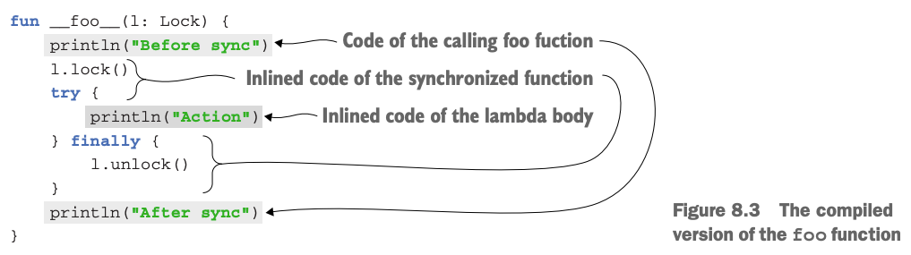

# 8. Higher-order functions: lamdas as parameters and return values

1. Declaring higher-order functions
2. Inline functions: removing the overhead of lambdas
3. Control flow in higher-order functions
4. Summary

> ### This chapter covers
>
> - Function types
> - Higher-order functions and 사용법
> - Inline functions
> - Non-local returns and labels
> - Anonymous functions

---

## 1. Declaring higher-order functions

```kotlin
public inline fun <T> Iterable<T>.filter(predicate: (T) -> Boolean): List<T> {
    return filterTo(ArrayList<T>(), predicate)
}
```

- _higher-order function_ : 다른 함수를 인자로 받거나 함수를 반환하는 함수
- e.g. `filter`

### Function types

```kotlin
val sum = { x: Int, y: Int -> x + y }
val action = { println(42) }

var funOrNull: ((Int, Int) -> Int)? = null // function type, function 이거나 null

// explicit
val sum: (Int, Int) -> Int = { x, y -> x + y }
val action: () -> Unit = { println(42) }
```

- `Unit` : Java의 `void`와 비슷한 역할
    - 생략 가능

```kotlin

fun performRequest(url: String, callback: (code: Int, content: String) -> Unit) {
    /* ... */
}
fun main() {
    val url = "http://kotl.in"
    performRequest(url) { code, content -> /* ... */ }
}
```

### Calling functions passed as arguments

```kotlin
fun twoAndThree(operation: (Int, Int) -> Int) {
    val result = operation(2, 3)
    println("The result is $result")
}

fun String.filter(predicate: (Char) -> Boolean): String {
    val sb = StringBuilder()
    for (index in 0 until length) {
        val element = get(index)
        if (predicate(element)) sb.append(element)
    }
    return sb.toString()
}

fun main() {
    twoAndThree { a, b -> a + b }
    twoAndThree { a, b -> a * b }

    println("ab1c".filter { it in 'a'..'z' })
}

```

### Using function types from Java

- 내부적으로 function type은 일반적인 인터페이스로 선언됨 e.g. `Function0<R>`, `Function1<P1, R>`, `Function2<P1, P2, R>`

````
/* kotlin declaration */
fun processTheAnswer(f: (Int) -> Int) {
    println(f(42))
}

/* Java usage */
processTheAnswer(number -> number + 1);

List<String> strings = new ArrayList<>();
strings.add("42");
CollectionsKt.forEach(strings, s -> {
    System.out.println(s);
    return Unit.INSTANCE; // 명시적으로 Unit 반환
});
````

### Default and null values for parameters with function types

```kotlin
fun <T> Collection<T>.joinToString(
    separator: String = ", ",
    prefix: String = "",
    postfix: String = "",
): String {
    val result = StringBuilder(prefix)
    for ((index, element) in this.withIndex()) {
        if (index > 0) result.append(separator)
        result.append(element)
    }
    result.append(postfix)
    return result.toString()
}

// default value
fun <T> Collection<T>.joinToString(
    separator: String = ", ",
    prefix: String = "",
    postfix: String = "",
    transform: (T) -> String = { it.toString() }, // default value : { it.toString() }
): String {
    val result = StringBuilder(prefix)
    for ((index, element) in this.withIndex()) {
        if (index > 0) result.append(separator)
        result.append(transform(element))
    }
    result.append(postfix)
    return result.toString()
}

fun main() {
    val letters = listOf("Alpha", "Beta")
    println(letters.joinToString())
    println(letters.joinToString { it.toLowerCase() })
    println(letters.joinToString(separator = "! ", postfix = "! ", transform = { it.toUpperCase() }))
}
```

```kotlin
fun <T> Collection<T>.joinToString(
    separator: String = ", ",
    prefix: String = "",
    postfix: String = "",
    transform: ((T) -> String)? = null, // default value : null
): String {
    val result = StringBuilder(prefix)
    for ((index, element) in this.withIndex()) {
        if (index > 0) result.append(separator)
        val str = transform?.invoke(element)
            ?: element.toString()
        result.append(str)
    }
    result.append(postfix)
    return result.toString()
}
```

### Returning functions from functions

````kotlin
enum class Delivery { STANDARD, EXPEDITED }

class Order(val itemCount: Int)

fun getShippingCostCalculator(delivery: Delivery): (Order) -> Double {
    if (delivery == Delivery.EXPEDITED) {
        return { order -> 6 + 2.1 * order.itemCount }
    }
    return { order -> 1.2 * order.itemCount }
}

fun main() {
    val calculator = getShippingCostCalculator(Delivery.EXPEDITED) // function type
    println("Shipping costs ${calculator(Order(3))}")
}
````

```kotlin
class ContactListFilters {
    var prefix: String = ""
    var onlyWithPhoneNumber: Boolean = false

    // higher-order function
    fun getPredicate(): (Person) -> Boolean {
        val startsWithPrefix = { p: Person ->
            p.firstName.startsWith(prefix) || p.lastName.startsWith(prefix)
        }
        if (!onlyWithPhoneNumber) {
            return startsWithPrefix
        }
        return { startsWithPrefix(it) && it.phoneNumber != null }
    }
}

data class Person(val firstName: String, val lastName: String, val phoneNumber: String?)

fun main() {
    val contacts = listOf(
        Person("Dmitry", "Jemerov", "123-4567"),
        Person("Svetlana", "Isakova", null)
    )
    val contactListFilters = ContactListFilters()
    with(contactListFilters) {
        prefix = "Dm"
        onlyWithPhoneNumber = true
    }
    println(contacts.filter(contactListFilters.getPredicate()))
}
```

### Removing duplication through lambdas

```kotlin
data class SiteVisit(
    val path: String,
    val duration: Double,
    val os: OS,
)
enum class OS { WINDOWS, LINUX, MAC, IOS, ANDROID }

val log = listOf(
    SiteVisit("/", 34.0, OS.WINDOWS),
    SiteVisit("/", 22.0, OS.MAC),
    SiteVisit("/login", 12.0, OS.WINDOWS),
    SiteVisit("/signup", 8.0, OS.IOS),
    SiteVisit("/", 16.3, OS.ANDROID)
)

fun main() {
    val avrgWindowsDuration = log
        .filter { it.os == OS.WINDOWS }
        .map(SiteVisit::duration)
        .average()
}
```

```kotlin
// higher-order function
fun List<SiteVisit>.averageDurationFor(os: OS) =
    filter { it.os == os }.map(SiteVisit::duration).average()

fun List<SiteVisit>.averageDurationForBetter(predicate: (SiteVisit) -> Boolean) =
    filter(predicate).map(SiteVisit::duration).average()

fun main() {
    println(log.averageDurationFor(OS.WINDOWS))
    println(log.averageDurationFor(OS.MAC))

    println(log.averageDurationForBetter { it.os in setOf(OS.ANDROID, OS.IOS) })
}
```

## 2. Inline functions: removing the overhead of lambdas

- 람다는 익명 클래스로 컴파일됨
- **람다를 사용할 떄마다 객체를 생성하고 메모리를 할당하는 오버헤드가 발생**
    - 람다 바디에서 변수를 캡처하면 더 많은 오버헤드 발생 (invocation마다 새로운 객체 생성)
- `inline` 접근제어다 : 컴파일러가 function call을 생성하지 않고, 호출마다 실제 function 구현 코드를 사용하게 해줌

### How inlining works

```kotlin
inline fun <T> synchronized(lock: Lock, action: () -> T): T {
    lock.lock()
    try {
        return action()
    } finally {
        lock.unlock()
    }
}

fun foo(l: Lock) {
    println("Before sync")
    synchronized(l) {
        println("Action")
    }
    println("After sync")
}
```



```kotlin
class LockOwner(val lock: Lock) {
    fun runUnderLock(body: () -> Unit) {
        synchronized(lock, body)
    }
}

// bytecode
class LockOwner(val lock: Lock) {
    fun __runUnderLock__(body: () -> Unit) {
        lock.lock()
        try {
            body() // body는 inline function이 아니므로 Inline되지 않음
        } finally {
            lock.unlock()
        }
    }
}
```

### Restrictions on inline functions

```kotlin
inline fun foo(inlined: () -> Unit, noinline notInlined: () -> Unit) {
    // ...
}
```

- 모든 람다가 인라인 될 수 없음
- 인라인 함수는 파라미터에 제한이 있음
    - 파라미터를 저장하여 어딘가에 쓴다면, 인라인 될 수 없음 (저장할 오브젝트가 필요하기 때문)

```kotlin
fun <T, R> Sequence<T>.map(transform: (T) -> R): Sequence<R> {
    return TransformingSequence(this, transform) // transform을 직접 호추하지 않고, 생성자에 전달
}
```

### Deciding when to declare functions as inline

- 일반적은 function call에 대해 JVM은 최적화를 수행
    - byte code -> machine code 변환 시 최적화 (inlining)
    - 함수를 호출한 지점을 알수있으므로 stack trace 명확
- kotlin inlining function의 장점
    - function call 뿐 아니라 extra class 오브젝트 생성도 없애줌
    - JVM의 최적화가 보장되지를 않음
    - 일반적인 람다에서 사용 불가능한 피쳐 지원 (e.g. non-local return)
- 주의점 : inline 크기를 작게 유지
    - inline의 부피가 크면, bytecode를 매 호출마다 복사하는 비용이 큼

### Using inlined lamdas for resource management

```java
// java 7 try-with-resources
static String readFirstLineFromFile(String path) throws IOException {
    try (BufferedReader br = new BufferedReader(new FileReader(path))) {
        return br.readLine();
    }
}
```

```kotlin
fun <T> Lock.withLock(action: () -> T): T {
    lock()
    try {
        return action()
    } finally {
        unlock()
    }
}
```

- resource : 디비 트랜잭션, 파일, 락 등의 자원
- `withLock` : kotlin standard library에 포함된 inline function
    - `Lock` 인터페이스 확장

```
val l: Lock = ...
l.withLock {
    // access the resource protected by this lock
}
```

```kotlin
fun readFirstLineFromFile(path: String): String {
    BufferedReader(FileReader(path)).use { br ->
        return br.readLine()
    }
}
```

- `use()` : closable reosurce에 대한 확장 함수
    - inline function

## 3. Control flow in higher-order functions

## 4. Summary

