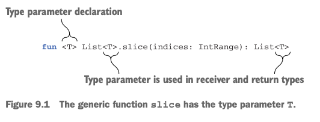
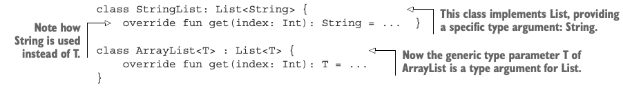
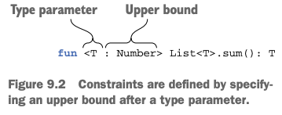
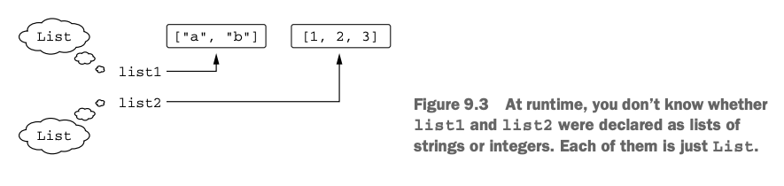
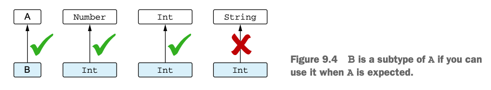
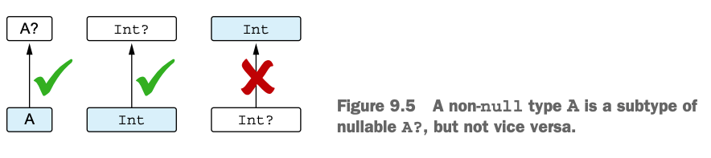
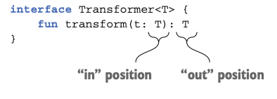
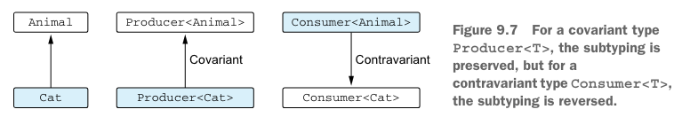
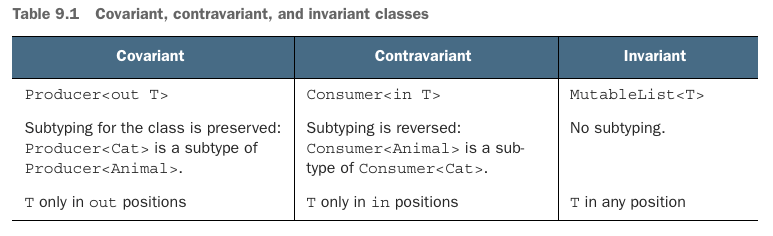
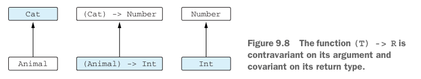

# 9. Generics

1. Generic type parameters
2. Generics at runtime: erased and reified type parameters
3. Variance: generics and subtyping
4. Summary

> ### This chapter covers
>
> - declaring generic functions and classes
> - Type erasure and reified type parameters
> - Declaration-site and use-site variance

---

## 1. Generic type parameters

- _Reified type parameters_ : runtime에 generic type을 알 수 있게 해줌
    - 일반적으로 type argument는 런타임에 지워지기 떄문에 불가능함
- _Declaration-site variance_ : 클래스 선언 시 variance를 지정

```kotlin
val authors = listOf("Dmitry", "Svetlana") // kotlin compiler의 type inference로 List<String>로 추론
```

- Generic은 _type parameter_ 로 타입을 정의할 수 있게 해줌
- 인스턴스가 생성될 때 _type argument_ 를 제공해야 함
    - e.g. `val list: List<String> = listOf("a", "b", "c")`
- Kotlin은 무조건 명시적으로 혹은 추론하여 type argument를 제공해야 함 (_raw type_ 미지원)
    - Java 1.5 (Generics가 처음 도입된 버전)이전 버전과 호환을 위함
    - _raw type_ : type argument를 제공하지 않은 경우

### Generic functions and properties



```kotlin
val letters = ('a'..'z').toList()
println(letters.slice<Char>(0..2)) // [a, b, c]
println(letters.slice(10..13)) // [k, l, m, n]
```

- _generic function_ : type parameter를 가지는 함수
    - type paramter는 function 호출시 특정 type으로 지정되어야함

```kotlin
fun <T> List<T>.filter(predicate: (T) -> Boolean): List<T>
val <T> List<T>.penultimate: T get() = this[size - 2]


fun main() {
    val authors = listOf("Dmitry", "Svetlana")
    val readers = mutableListOf<String>(/* ... */)
    readers.filter { it !in authors }

    println(listOf(1, 2, 3, 4).penultimate) // 3
}
```

### Declaring generic classes

- class 이름 옆에 type parameter를 선언

```kotlin
interface List<T> {
    operator fun get(index: Int): T
}
```



```kotlin
interface Comparable<T> {
    fun compareTo(other: T): Int
}
class String : Comparable<String> {
    override fun compareTo(other: String): Int = /* ... */
}
```

### Type parameter constraints



- _Type parameter constraints_ : type parameter가 특정 type을 상속하거나 구현해야 함을 명시
    - `fun <T : Number> List<T>.sum(): T`
- _upper bound_ constraint : type parameter가 특정 type이거나 subtype이어야함
    - `fun <T : Number> List<T>.sum(): T`

```kotlin
fun <T : Number> List<T>.sum(): T


fun <T : Number> oneHalf(value: T): Double {
    return value.toDouble() / 2.0
}

fun <T : Comparable<T>> max(first: T, second: T): T {
    return if (first > second) first else second
}

fun <T> ensureTrailingPeriod(seq: T)
        where T : CharSequence, T : Appendable { // type parameter가 CharSequence와 Appendable을 상속해야함
    if (!seq.endsWith('.')) {
        seq.append('.')
    }
}

fun main() {
    println(listOf(1, 2, 3).sum()) // 6
    println(oneHalf(3)) // 1.5
    println(max("kotlin", "java")) // kotlin

    val helloWorld = StringBuilder("Hello World")
    ensureTrailingPeriod(helloWorld)
    println(helloWorld) // Hello World.
}
```

### Making type parameters non-null

```kotlin
class Processor<T> {
    fun process(value: T) {
        value?.hashCode() // value is nullable
    }
}

class ProcessorNotNull<T : Any> {
    fun process(value: T) {
        value.hashCode() // value is non-null
    }
}
```

- upper bound를 생략하면 `: Any?` 가 생략된 것과 같음
- `: Any` 를 사용하면 non-null type parameter를 강제할 수 있음

## 2. Generics at runtime: erased and reified type parameters

- _type erasure_ : type arguments가 런타임에는 지워짐
- `inline` function을 사용하면 reified type parameter를 사용할 수 있음
    - type argument를 런타임에도 알 수 있게 해줌

### Generics at runtime: type checks and casts



- Kotlin도 Java 처럼 런타임에 generic이 지워짐
- 즉, 제네릭 클래스의 인스턴스는 런타임에 type argument를 알 수 없음
- 장점 : 타입 정보를 메모리에 가지고 있을 필요 없음 (리소스 절약)
- e.g. `List<String>` -> runtime에는 `List`로만 알 수 있음

```kotlin
if (value is List<String>) { // ERROR: Cannot check for instance of erased type
    // ...
}

if (value is List<*>) { // OK: type erasure
    // ...
}

fun printSum(c: Collection<*>) {
    val intList = c as? List<Int>
        ?: throw IllegalArgumentException("List is expected")

    println(intList.sum())
}

fun printSumBetter(c: Collection<Int>) {
    if (c is List<Int>) {
        println(c.sum())
    }
}

fun main() {
    printSum(setOf(1, 2, 3)) // IllegalArgumentException
    printSum(listOf("a", "b", "c")) // ClassCastException

    printSumBetter(
        listOf(
            "a",
            "b",
            "c"
        )
    ) // compile error : Type mismatch: inferred type is List<String> but Collection<Int> was expected
}
```

- _star projection_ : `List<*>` (모든 type argument를 받을 수 있음)

### Declaring functions with reified type parameters

```kotlin
fun <T> isA(value: Any) = value is T // ERROR: Cannot check for instance of erased type
```

- inline function은 reified type parameter를 사용할 수 있음
    - `inline` function : compiler가 function body를 호출하는 곳에 복사해 넣음
    - 람다와 사용하면 익명 클래스 생성을 줄여 성능 향상

```kotlin
inline fun <reified T> isA(value: Any) = value is T

fun main() {
    println(isA<String>("abc")) // true
    println(isA<String>(123)) // false

    // using filterIsInstance standard library function
    val items = listOf("one", 2, "three")
    println(items.filterIsInstance<String>()) // [one, three]
}

// filterIsInstance standard library function (축약)
inline fun <reified T> Iterable<*>.filterIsInstance(): List<T> {
    val destination = mutableListOf<T>()
    for (element in this) {
        if (element is T) { // reified type parameter
            destination.add(element)
        }
    }
    return destination
}
```

#### inline function에서만 reification이 가능한 이유

- `inline` function은 컴파일러가 호출한 곳에 바이트 코드를 넣음
- 즉, 인라인 함수를 호출한 곳마다 다른 바이트 코드가 생성됨 (컴파일러는 이미 type argument를 알고 있음)

### Replacting class references with reified type parameters

```kotlin
val serviceImpl = ServiceLoader.load(Service::class.java)
// better
val serviceImpl = loadService<Service>()

inline fun <reified T> loadService() {
    return ServiceLoader.load(T::class.java)
}
```

- `::class.java` : `java.lang.Class` 에 상응하는 Kotlin class 가져옴

### Restrictions on reified type parameters

- 가능
    - `is`, `!is`, `as`, `as?` 연산자 사용 (type check, cast)
    - `::class` 같은 Kotlin reflection API 사용
    - `java.lang.Class` 사용
    - 다른 function을 호출할 떄 argument로 사용
- 불가능
    - type parameter로서 정의된 클래스의 새로운 인스턴스 생성 (e.g. `T()`)
    - type parameter 클래스의 companion object에 접근
    - non-reified type parameter를 사용한 함수 호출
    - 클래스의 type parameter, property, non-inline function을 `reified`로 선언

## 3. Variance: generics and subtyping

- _variance_ : subtyping 관계를 유지하면서 generic type을 사용하는 방법
    - e.g. `List<String>`은 `List<Any>`의 subtype이 아님

### Why variance exists: passing an argument to a function

```kotlin
fun printContents(list: List<Any>) {
    println(list.joinToString())
}

fun addAnswer(list: MutableList<Any>) {
    list.add(42)
}

fun main() {
    val strings = listOf("abc", "bac")
    printContents(strings) // abc, bac

    val strs = mutableListOf("abc", "bac")
    addAnswer(strs) // compile err : Type mismatch: inferred type is MutableList<String> but MutableList<Any> was expected
}
```

### Classes, types, and subtypes



- non-generic class에서는 _type_ 이랑 _class_ 가 같음
    - e.g. `var x: String` 에서 `x`의 타입은 `String`이고 클래스도 `String`임
    - `var x: String?` 에서 `x`는 2가지 타입 가능 (`String` or `null`)
- `List` 는 type이 아님!, `List` 는 class
    - `List` class는 이런 타입이 가능 `List<String>`, `List<Int>`, `List<Any>`, `List<List<String>>`, ...
- generic class는 무한한 타입이 가능함
- `subtype` : `B`가 `A`의 subtype이면 `B`를 `A` 대신 사용할 수 있음
    - `Number`의 subtype은 `Int`, `Double`, `Float`, ...
- 컴파일른 다음 떄마다 매번 subtype을 확인함
    - value를 변수에 할당 (subtype만 가능)
    - function에 argument 전달

```kotlin
fun test(i: Int) {
    val n: Number = i
    fun f(s: String) {
        // ... 
    }
    f(i) // compile error : Type mismatch: inferred type is Int but String was expected
}
```



- 일반적으로 subtype이면 subclass임
- nullable은 non-nullable의 subtype이 될 수 없음

```kotlin
val s: String = "abc"
val t: String? = s

val ss: String = t // compile err : Type mismatch: inferred type is String? but String was expected
```

- _covariant_ (공변) : `A`가 `B`의 subtype이면 `List<A>`는 `List<B>`의 subtype
    - e.g. `List<String>`은 `List<Any>`의 subtype
- _invariant_ (무공변) : `List<A>`와 `List<B>`는 서로 subtype이 아님

### Convariance: preserved subtyping relation

- `Cat`이 `Animal`의 subtype이면 `Producer<Cat>`은 `Producer<Animal>`의 subtype이어야 함
- kotlin에서 공변을 구현하기 위해서 `out` 키워드를 사용함
- _out_ position일 떄만 사용 권장
    - _out_ : `T` type의 값을 생산함, `T` 를 사용 (consume) 하지 않음



```kotlin
// T에 대해 공변으로 선언
interface Producer<out T> {
    fun produce(): T
}

open class Animal {
    fun feed() {
        println("feed")
    }
}

class Cat : Animal() {
    fun cleanLitter() {
        println("clean")
    }
}

class Herd<T : Animal> { // TODO: 공변으로 선언 out T
    val size: Int get() = 0
    operator fun get(i: Int): T { // T를 오직 out position에서만 사용
        TODO()
    }
}

fun feedAll(animals: Herd<Animal>) {
    for (i in 0 until animals.size) {
        animals[i].feed()
    }
}

fun takeCareOfCats(cats: Herd<Cat>) {
    for (i in 0 until cats.size) {
        cats[i].cleanLitter()
    }
    feedAll(cats) // compile error : Type mismatch: inferred type is Herd<Cat> but Herd<Animal> was expected
}
```

```kotlin
// dangerous : T에 대헤 out으로 선언했지만 T를 consume하는 함수를 만들 수 있는 상태
class Herd<out T : Animal>(vararg animals: T) {
    // ...
}


// dangerouse : T는 out 할 수 없음, leadAnimal에 대한 setter가 이미 있음 
class Herd<T : Animal>(var leadAnimal: T, vararg animals: T) {
    // ...
}

// safe : out T, private leadAnimal
class Herd<out T : Animal>(private var leadAnimal: T, vararg animals: T) {

}
```

- constructor parameter는 `in`, `out` 둘 다 아님
    - `val` 은 getter를 제공하므로 `out` position에 사용됨
    - `var` 은 getter와 setter를 제공하므로 `out`, `in` position에 사용됨

### Contravariance: reversed subtyping relation



- _contravariance_ 은 convariance의 반대 컨셉
- type parameter에 대해 _contravariant_ 로 선언한 제네릭 클래스는 다음 관계가 성립
    - `A`가 `B`의 subtype이면 `Consumer<B>`는 `Consumer<A>`의 subtype
- e.g. `Comparator<String>`은 `Comparator<Any>`의 subtype이어야 함

```kotlin
// T에 대해 반공변으로 선언
interface Comparator<in T> {
    fun compare(e1: T, e2: T): Int {
        // ...
    }
}

fun main() {
    val anyComparator = Comparator<Any> { e1, e2 -> e1.hashCode() - e2.hashCode() }
    val strings = listOf("abc", "bac")
    strings.sortedWith(anyComparator)
}
```



```kotlin
// sub
interface Function1<in P, out R> {
    operator fun invoke(p: P): R
}
```



### Use-site variance: specifying variance for type arguments

- _declaration-site variance_ : 클래스 선언 시 variance를 지정
- _use_site variance_ : type argument를 사용할 때 variance를 지정

```kotlin
// T가 invariant type 임에도, consume, produce

fun <T : R, R> copyData(source: MutableList<T>, destination: MutableList<R>) {
    for (item in source) {
        destination.add(item)
    }
}

fun main() {
    val numbers = mutableListOf(1, 2, 3)
    val anyItems = mutableListOf<Any>() // Int는 Any의 subtype
    copyData(numbers, anyItems)
    println(anyItems) // [1, 2, 3]

}
```

```kotlin
// T를 out position으로 선언
// type projection
fun <T> copyData(source: MutableList<out T>, destination: MutableList<T>) {
    for (item in source) {
        destination.add(item)
    }
}
```

- variance modifier를 사용하면 type argument를 사용할 때 variance를 지정할 수 있음
- `<out T>` : T를 out position으로 선언
    - `source`의 `T`는 `destination`의 `T`의 subtype이어야 함
    - `T` 를 in position으로 사용하면 컴파일러가 에러를 발생시킴

```kotlin
val list: MutableList<out Number> = mutableListOf(1, 2, 3)
list.add(4) // compile err : Out-projected type 'MutableList<out Number>' prohibits the use of 'public abstract fun add(element: E): Boolean defined in kotlin.collections.MutableList'
```

```kotlin
// T를 in position으로 선언 : destination의 T는 source element의 supertype이어야 함
fun <T> copyData(source: MutableList<T>, destination: MutableList<in T>) {
    for (item in source) {
        destination.add(item)
    }
}
```

### Star projection: using * instead of a type argument

- _star-projection_ 문법 : `*` 를 사용하여 type argument를 생략할 수 있음
- `List<*>` : 모든 type argument를 받을 수 있음
- `List<*>` 와 `List<Any?>` 는 다름
    - `List<*>` : 모든 type argument를 받을 수 있으나 compile-time에는 알 수 없음
    - `List<Any?>` : 모든 type argument를 받을 수 있으며 `Any?` 타입임

```kotlin
val list: MutableList<Any?> = mutableListOf("abc", 1, 2.0)
val chars = mutableListOf('a', 'b', 'c')
val unkownEl: MutableList<*> = if (Random().nextBoolean()) list else chars
unkownEl.add(42) // compile err : Unresolved reference. None of the following candidates is applicable because of receiver type mismatch: public abstract fun add(element: Nothing): Boolean defined in kotlin.collections.MutableList
```

- 유용할 떄 : type argument 정보가 중요치 않을 때
    - signature의 type argument 사용하는 메서드가 전혀 없음
    - data를 읽기많만 하고 type은 신경 쓰지 않음

```kotlin
fun printFirst(list: List<*>) {
    if (list.isNotEmpty()) {
        println(list.first())
    }
}

fun <T> printFirst(list: List<T>) {
    if (list.isNotEmpty()) {
        println(list.first())
    }
}
```

````kotlin
interface FieldValidator<in T> {
    fun validate(input: T): Boolean
}
object DefaultStringValidator : FieldValidator<String> {
    override fun validate(input: String) = input.isNotEmpty()
}
object DefaultIntValidator : FieldValidator<Int> {
    override fun validate(input: Int) = input >= 0
}

fun main() {
    val validators = mutableMapOf<KClass<*>, FieldValidator<*>>()
    validators[String::class] = DefaultStringValidator
    validators[Int::class] = DefaultIntValidator

    validators[String::class]!!.validate("") // compile err : Kotlin: Type mismatch: inferred type is String but Nothing was expected

    val stringValidator = validators[Int::class] as FieldValidator<String> // compiled
    stringValidator.validate("") // runtime err : java.lang.ClassCastException: DefaultIntValidator cannot be cast to DefaultStringValidator
}
````

```kotlin
// solution
object Validators {
    private val validators = mutableMapOf<KClass<*>, FieldValidator<*>>()
    fun <T : Any> registerValidator(
        kClass: KClass<T>, fieldValidator: FieldValidator<T>,
    ) {
        validators[kClass] = fieldValidator
    }

    @Suppress("UNCHECKED_CAST")
    operator fun <T : Any> get(kClass: KClass<T>): FieldValidator<T> =
        validators[kClass] as? FieldValidator<T>
            ?: throw IllegalArgumentException("No validator for ${kClass.simpleName}")
}

fun main() {
    Validators.registerValidator(String::class, DefaultStringValidator)
    Validators.registerValidator(Int::class, DefaultIntValidator)

    println(Validators[String::class].validate("Kotlin")) // true
    println(Validators[Int::class].validate(42)) // true
}
```

## 4. Summary

- Kotlin Generics는 Java와 비슷
    - Java처럼 generic funciton, class 가능
- Java처럼, generic type에 대한 type argument는 런타임에 지워짐
- `is` 연산자와 type argument 사용 불가능 (런타임에 지워짐)
- `inline` function을 사용하면 reified type parameter를 사용할 수 있음
    - `is` 연산자와 type argument 사용 가능
- Varianc (공변) : base class를 가진 2개의 generic type중 서로 subtype/supertype 관계를 지정하는 방법
- `out` position : type parameter에 covariant (공변) 선언
- `in` position : type parameter에 contravariant (반공변) 선언
- Kotlin의 `List` 는 covariant (공변)로 선언되어 있음
    - 즉, `List<String>`은 `List<Any>`의 subtype
- funtion interface는 첫번째 파라미터는 contravariant (반공변), 두번째 파라미터는 covariant (공변)로 선언됨
    - `(Animal) -> Int` 는 `(Cat) -> Number`의 subtype
- _declaration site variance_ : 클래스 선언 시 variance를 지정
- _use-site variance_ : type argument를 사용할 때 variance를 지정
- star-projection 문법은 type arguments를 모르거나 중요치 않을때 사용

