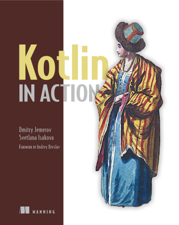

# Kotlin In Action

### PART 1 INTRODUCING KOTLIN

1. [Kotlin: what and why](1_kotlin-what-and-why.md)
2. [Kotlin basics](2_kotlin-basics.md)
3. [Defining and calling functions](3_defining-and-calling-functions.md)
4. Classes, objects, and interfaces
5. Programming with lambdas
6. The Kotlin type system

### PART 2 EMBRACING KOTLIN

7. Operator overloading and other conventions
8. Higher-order functions: lambdas as parameters and return values
9. Generics
10. Annotations and reflection
11. DSL construction